```{r setup, include=FALSE}
knitr::opts_chunk$set(echo = FALSE)
```

## 1.0 Data Sources
Data Source | Name | Description | Link
------------- | ------------- | ------------- | -------------
Indonesia Geospatial | BATAS DESA DESEMBER 2019 DUKCAPIL KALIMANTAN TIMUR | Village boundary and population data for East Kalimantan 2019 | https://www.indonesia-geospasial.com/2020/04/download-shapefile-shp-batas-desa.html
Indonesia Geospatial | Geology Kalimantan Timur | Geology Shapefile of East Kalimantan | https://www.indonesia-geospasial.com/2020/03/download-data-shapefile-shp-geologi-se.html 
Indonesia Geospatial |KOTA BALIKPAPAN | Topographical data layers of Balikpapan City | 	https://www.indonesia-geospasial.com/2020/01/shp-rbi-provinsi-kalimantan-timur.html
Indonesia Geospatial | KOTA SAMARINDA | Topographical data layers of Samarinda City | 	https://www.indonesia-geospasial.com/2020/01/shp-rbi-provinsi-kalimantan-timur.html
Indonesia Geospatial | KUTAI KARTANEGARA | Topographical data layers of Kutai Kartanegara Regency | 	https://www.indonesia-geospasial.com/2020/01/shp-rbi-provinsi-kalimantan-timur.html
Indonesia Geospatial | 	OSM Buildings | Detailed building footprints throughout Indonesia | https://www.indonesia-geospasial.com/2020/12/download-shp-pemukiman-detail-seluruh.html
Indonesia Geospatial | PENAJAM PASER UTARA | Topographical data layers of Penajam Paser Regency | https://www.indonesia-geospasial.com/2020/01/shp-rbi-provinsi-kalimantan-timur.html
Indonesia Geospatial | 30. Provinsi Kalimantan Timur | Digital elevation model at 30m resolution | https://www.indonesia-geospasial.com/2020/01/download-dem-srtm-30-meter-se-indonesia.html
Indonesia Geospatial | Titik Api Hotspot se-Indonesia Tahun 2014 - 2019  | Indonesia fire Hotspot data from 2014-2019 | https://www.indonesia-geospasial.com/2020/04/shapefile-shp-titik-api-hotspot.html


## 2.0 General Notes
### <span style="text-decoration:underline">2.1 Saving layers in GeoPackage format</span>
Always remember to save all the layers in a **GeoPackage** format. 


+ Right click on the **Layer → Export → Save Features As...**


The Save Vector Layer as dialogue box will appear.


+ Format: **GeoPackage**
+ File name: Navigate to the GeoPackage file in which you want to save your layer in → **Indonesia.gpkg**
+ CRS: Set this to the project CRS, **ESPG: 23845 - DGN95 / Indonesia TM-3 zone 54.1**. 

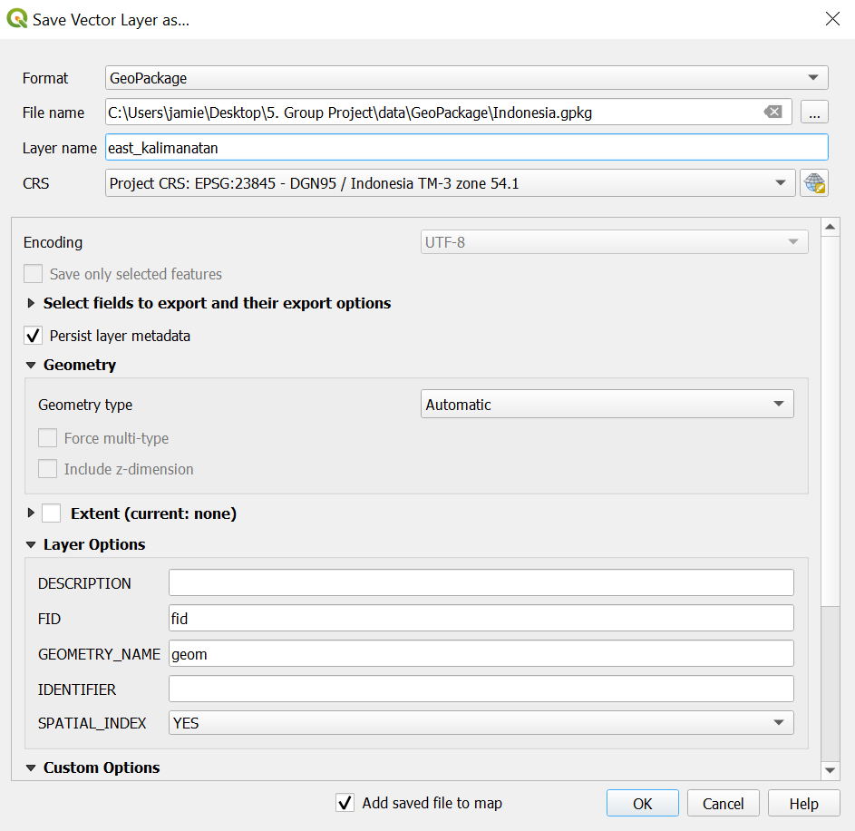

+ Click on **OK** and close the dialogue box.
+ Delete the unnecessary layers after GeoPackaging it.

### <span style="text-decoration:underline">2.2 Coordinate Reference System</span>
**Name:** EPSG:23845 – DGN95/Indonesia TM-3 zone 54.1


**Units:** Meters


**Method:** Transverse Mercator


**Celestial body:** Earth


**Reference:** Static (relies on a datum which is plate-fixed)


## 3.0 Data Preparation
### <span style="text-decoration:underline">3.1 Selecting study area polygon</span>
+ Add BATAS_DESA_DESEMBER_2019_DUKCAPIL_KALIMANTAN_TIMUR layer, open attribute table and click on **Select by Expression**.

The **Select by Expression** dialogue box will appear.

+ Under the Fields and Values drop-down list, double click on **KECAMATAN** which represents districts.
+ Click on **equal sign '='**
+ Click on the **All Unique** button at the right column 
+ Add the expression into the expression pane as shown below to select the required study area.

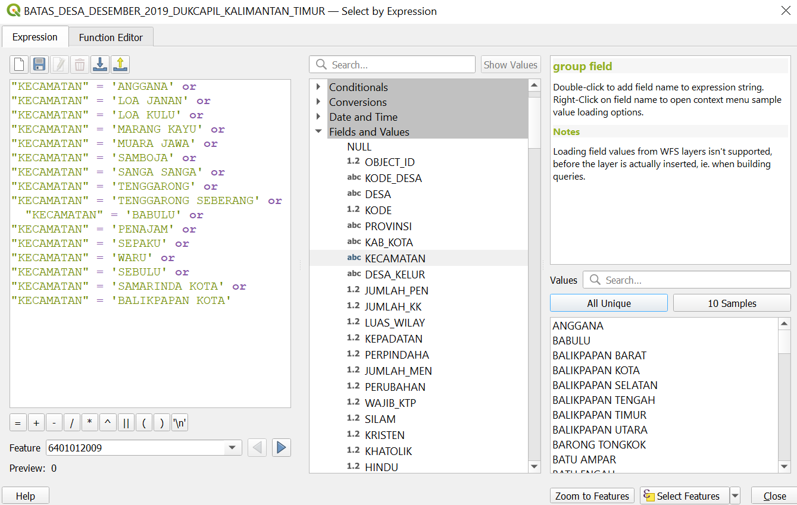

+ Click on **Select Features** and it should appear similar to what is shown below 


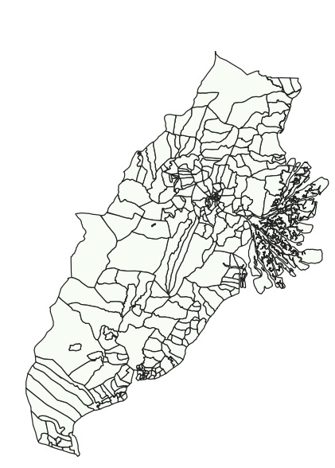

+ Right click on the **Layer → Export → Save selected features as**
+ Geopackage the selected features and name the layer **east_kalimantan.**

### <span style="text-decoration:underline">3.2 Adding the necessary layers for analysis</span>
We will now be adding layers we need for both the *Report of Survey (Task 1)* and *Site Selection (Task 2).* These layers can be found in the Kota Balikpapan, Kota Samarinda, Kutai Kartanegara and Penajam Paser Utara data files that were previously downloaded. For hotspots data, it can be found in the Titik Api Hotspot se-Indonesia Tahun data file from 2014 - 2019. 

The following shapefile layers should be added to QGIS:

English Name | Layer to be added
------------- | ------------- 
Agriculture - Plantation | Agrikebun
Agriculture - Rice field | Agrisawah
Agrifield | Agriladang
Airport points | Airport_PT
Airport polygons | Airport_AR
Bus terminals | Terminal Bus 
Coastline | Pesisir
Education | Pendidkan
Electricity | Genlistrik & Menaralistrik 
Forest - Wet | Non agri hutan basah
Forest - Dry | Non agri dry forest
Forest - Reed | Nonagrialang
Forest - Shrubs | Non agri semak belukar
Health Services | Layanan kesehantan
Hospitals | Rumah sakit
Hotspots | Titik Api Hotspot se-Indonesia Tahun 2014-2019
Industry | Industri
Manufacturing | Further extracted from Industri layer called ‘Industri Manufaktur Lainnya’ under REMARK
Mining - Coal | Further extracted from Industri layer called ‘Pertambangan Batu Bara’under REMARK
Mining - Other | Further extracted from Industri layer called ‘Pertambangan  Lainnya’under REMARK
Mining - Open (Surface Mining) | Tambang_AR
Phone Towers | Menaratelpon
River | Sungai_LN
Roads | Jalan
Seaport points| Pelabuhan_PT
Settlements | Pemukiman 


### <span style="text-decoration:underline">3.3 Merging layers</span>
Since we have data scattered in different folders (e.g. road shapefiles from Kota Balikpapan, Kota Samarinda and more), we will be merging them into one layer for a cleaner QGIS environment. The layers in the table in *section 3.2* should be merged as they are from the 4 different folders. 

+ From the top menu bar, select **Vector → Data Management Tools → Merge Vector Layers.**

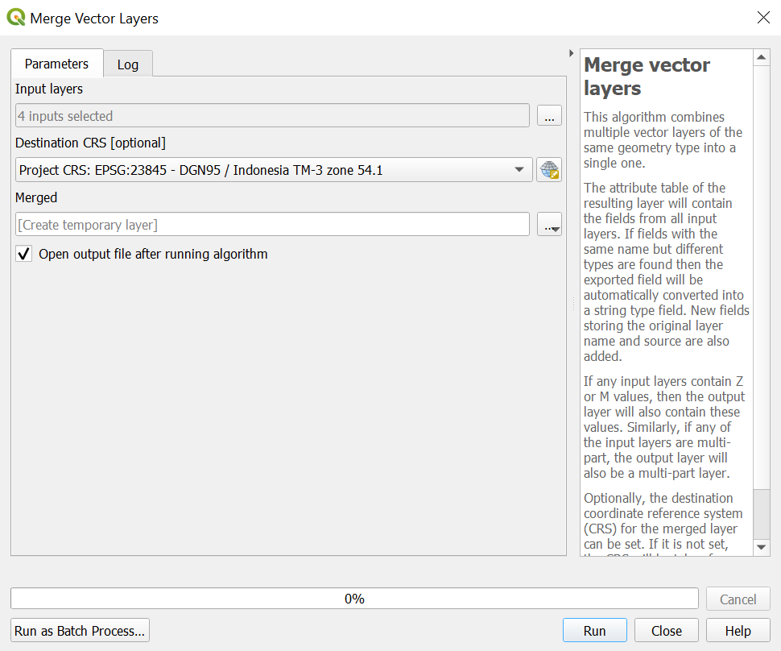

+ Under Input layers, click on the more icon at the end to select the layers in which you want to merge.
+ For destination CRS, select the **project CRS (EPSG:23845)**
+ Click on **Run**. 
+ A temporary merged layer will be created.
+ The temporary layer should be clipped *(section 2.3.4)* to remove all unnecessary points and then saved into GeoPackage format. 

> **Repeat** this process of merging for all the other necessary layers 

### <span style="text-decoration:underline">3.4 Clipping the various layers</span>
+ We will be clipping the layers as mentioned above so that points outside of east_kalimantan will be cleaned away to keep only the points and polygons within our study area. 

+ From the top menu bar, click on **Vector → Geoprocessing → Clip**

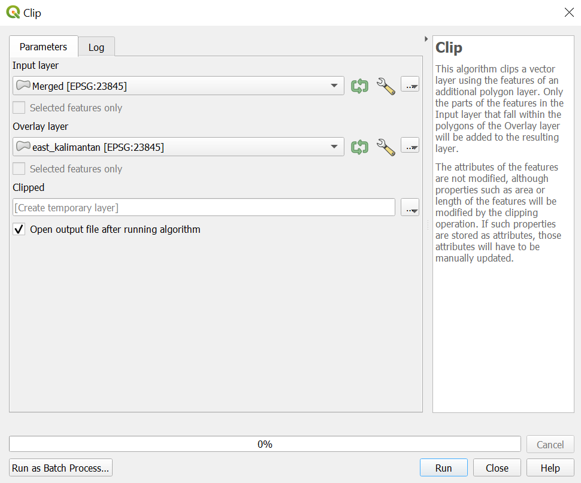

+ For the Input layer, select from the drop down menu the layer in which we would like to clip. Note that all the layers merged in the previous section should be clipped.
+ Click on the spanner beside the Input layer and select from the drop down menu **Do not Filter (Better Performance).**

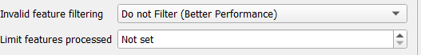

+ For Limit features processed, select **Not set**
+ For Overlay layer, select **east_kalimantan.**
+ Click on the spanner beside the Overlay layer and select from the drop down menu **Do not Filter (Better Performance).**
+ Geopackage clipped layer and remove the temporary clipped layer and merged layers.

>**Repeat** this process of clipping for all the other necessary layers. 

## 4.0 Data cleaning
### <span style="text-decoration:underline">4.1 Road network </span>
+ Right click on the layer **roads_merged** and open attribute table. 
+ Select by expression the following roads: **Jalan Arteri, Jalan Lokal, Jalan Kolektor.** 

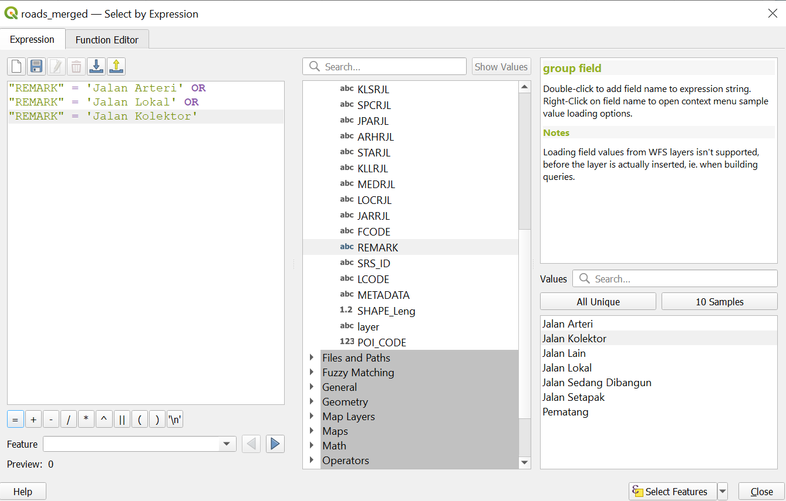

+ Next, save the selected features into the GeoPackage and name the layer connectingRoads.

### <span style="text-decoration:underline">4.2 Airport buffer </span>

+ We will first dissolve our airport polygon layer as we do not want to create multiple buffer for scenarios like this where there are 3 different polygons representing 1 airport

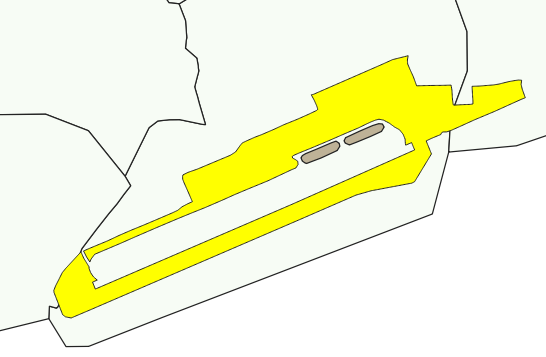

* Go to **Vector → Geoprocessing Tools → Dissolve**
    + For the input layer, we will select **Airport** 
    
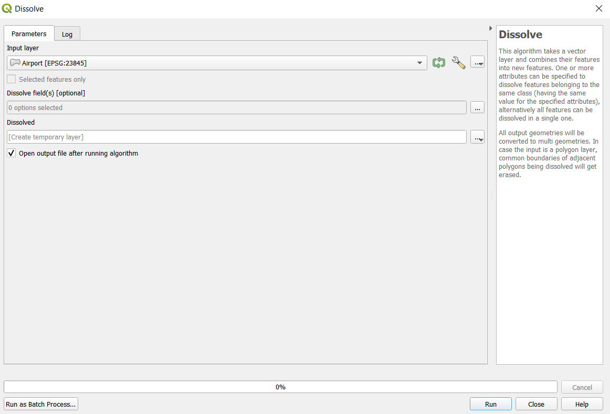

+ Click on **run**

+ We will have a layer called ‘Dissolved’. Save it to the Geopackage and rename it as **AirportDissolved**
+ Next, we want to create a buffer zone of 3.5km to airport for our accessibility to airport 
+ According to our research, a buffer zone of 3.5km from the airport zone will be used so as to minimize noise pollution in our proposed capital site. 
+ Using the AirportDissolved layer, we will create a 3.5km buffer 
* Go to Vector > Geoprocessing tools > Buffer
   + For the input layer, we will select **AirportDissolved**
   + Distance will be **3500 meters** or **3.5 kilometers** is also acceptable
   + Segments we will change to **100**
   + End cap style and Join style will be **Round** and Miter limit will be default at 2

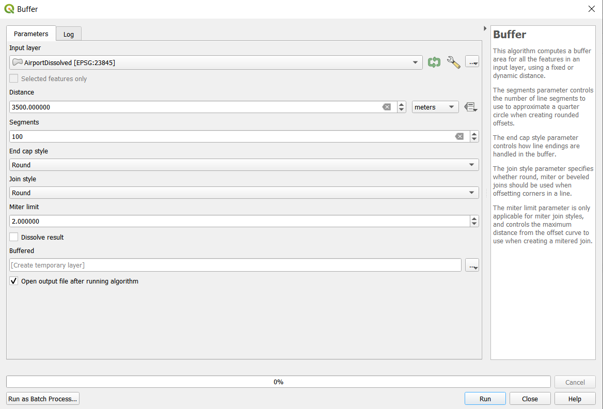

+ Click on **Run**
+ A new layer called **buffer** will be created
+ Save it to our Geopackage as **AirportBuffer**

### <span style="text-decoration:underline">4.3 Hotspot heatmap </span>
+ From the top menu bar, select **Processing → Toolbox → search for kernel density**
+ Select **Heatmap (Kernel Density Estimation)**

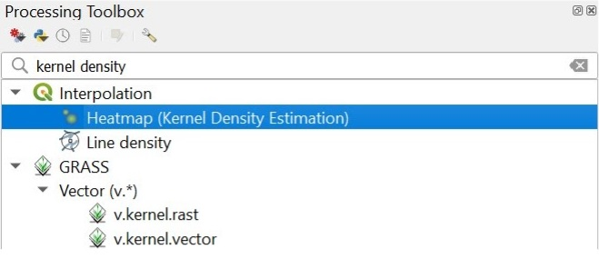

In the Heatmap dialog window:

+ Point layer: **hotspots_merged**
+ Radius will be **15000 meters**
+ X and Y size pixels = **100**

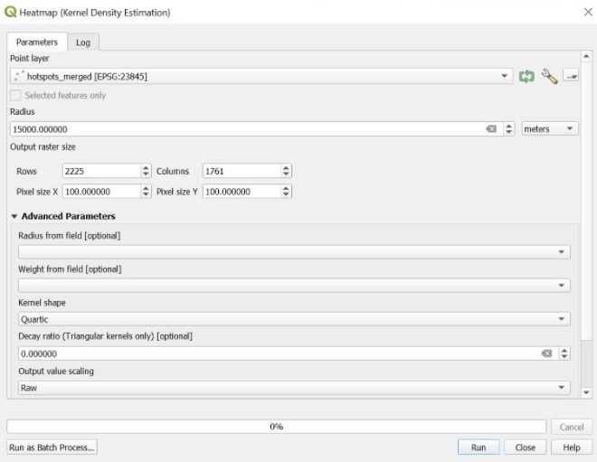

+ Click on **Run** and close the dialogue box.
+ Save this into the GeoPackage as **hotspots_heatmap.**

We will now change the symbology of this layer to better visualise it.

+ Right click on the layer and click on **Properties → Symbology**
+ Render Type: **Singleband Pseudocolour**
+ Colour Ramp: **Red**

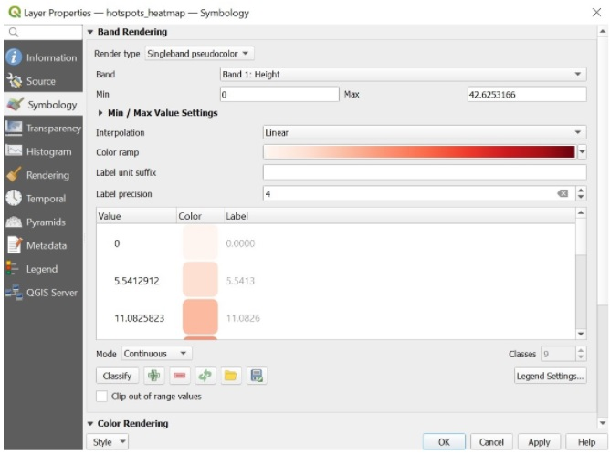

**The map should look like the image below: ** 

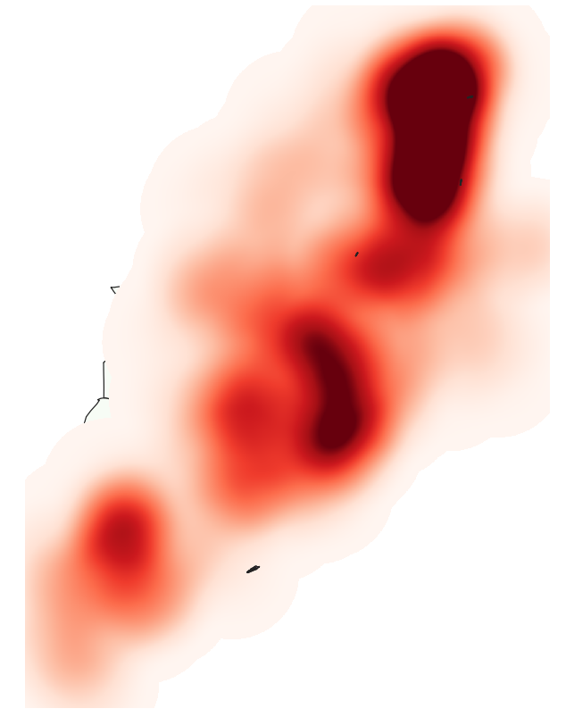

## 5.0 Raster, proximity and slope
### <span style="text-decoration:underline">5.1 Extracting raster data</span>

+ Import the **DEM SRTM 30M KALIMANTAN TIMUR** layer.
+ From the menu bar, select **Raster →  Extraction → Clip Raster by Extent.**
+ For Input layer, select **DEM SRTM 30M KALIMANTAN TIMUR** from the drop-down list.
+ For Clipping extent, click on the icon at the end of the option then select **Calculate from Layer.**
+ Select **east_kalimantan** from the drop-down list.

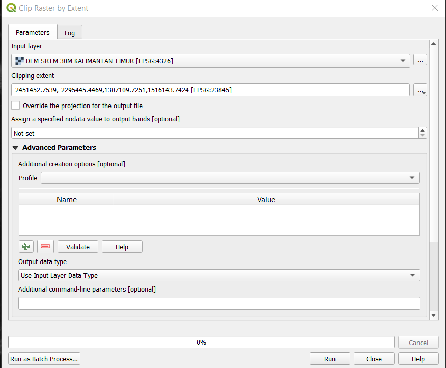

+ Click on **Run**

+ Geopackage the clipped raster

+ Make sure to change Format to Geopackage in the drop down list.
+ For Layer name, call it **DEM.**
+ Under extent, click on the drop down list **Calculate from Layer** and Select **east_kalimantan.**
+ Set resolution of **30m by 30m**

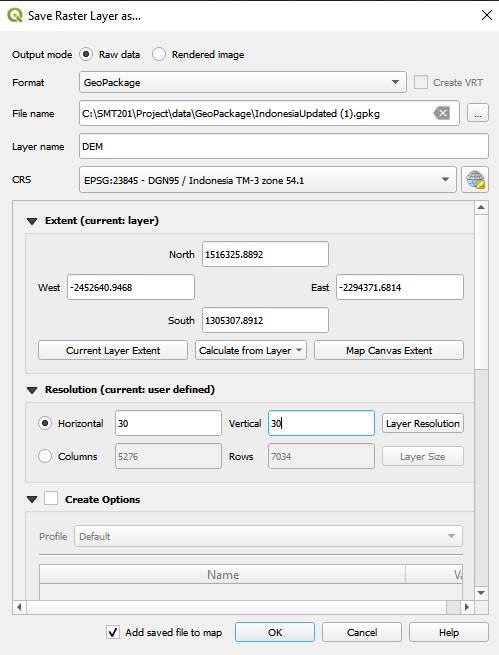

+ When we are ready, click on **OK** 

### <span style="text-decoration:underline">5.2 Creating attribute field for rastering</span>

+ At the **Layers** panel, click on **connectingRoads**
+ From the icon bar, click on the Open **Attribute Table** icon and click on **Open field calculator**
+ For **Output field**  name, type **POI_CODE** 
+ At the **Expression**  pane, type *1*

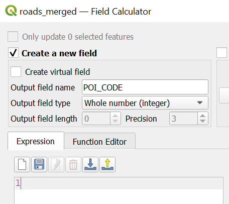

+ Click on the **OK** button to run the function.

+ A column called **POI_CODE** will be created.

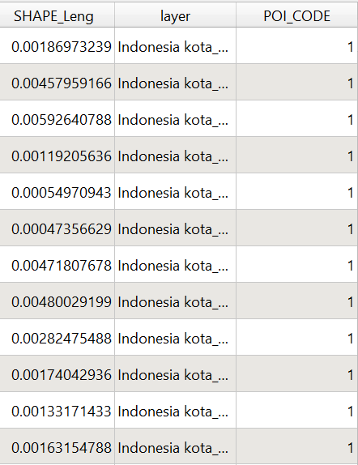

### <span style="text-decoration:underline">5.3 Rastering the layers</span>
+ From the menu bar, select **Raster → Conversion → Rasterise (Vector to Raster)**
+ For **Input layer**, select **roads_merged** from the drop-down list.
+ For Field to use for a **burn-in value**, select **POI_CODE** from the drop-down list.
+ For **Output raster size units**, select **Georeferenced units**.
+ Keep both horizontal and vertical resolutions at **100** (meaning 100m by 100m resolution).
+ For **Output extent**, click on **Calculate from Layer**
+ Select **DEM** from the drop-down list.

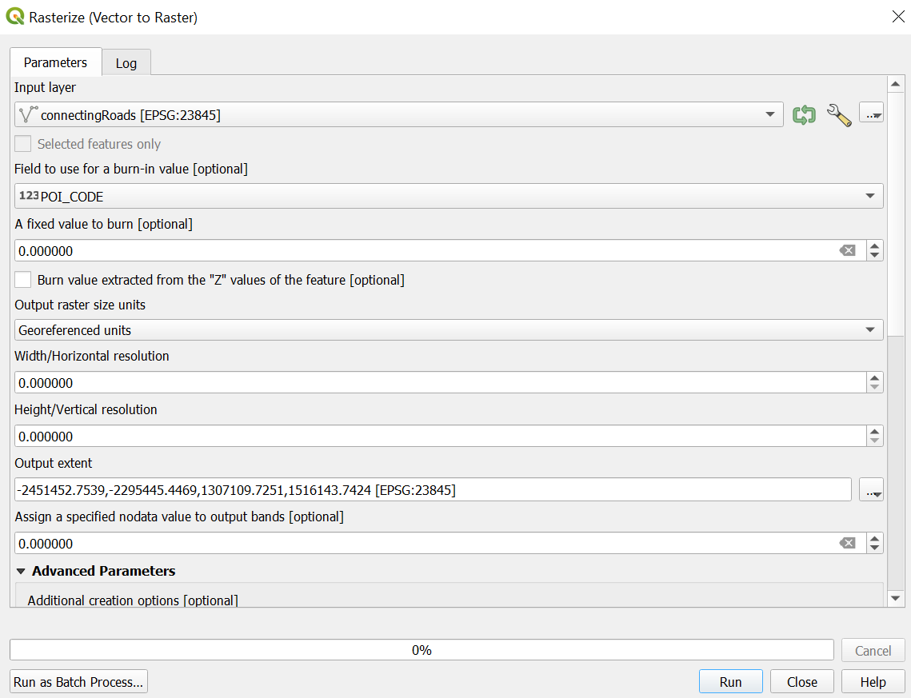

+ Click on the **Run** button.
+ A temporary layer will be created.
+ Geopackage the layer and call it **connectingRoads_rasterized**

> **Repeat** for the rest of the dataset giving the names to each of the layers as shown below:

Layer to be rasterized | Final Layer Name
------------- | ------------- 
disaster_merged *(Note that this layer is formed by merging the river and coastline layers)* | disaster_rasterized
forest | forest_rasterized
seaport | seaport_rasterized
connectingRoads | connectingRoads_rasterized
AirportBuffer | airport_rasterized
settlements | settlement_rasterized 

### <span style="text-decoration:underline">5.4 Proximity calculation</span>
+ For the menu bar, select **Raster → Analysis → Proximity (Raster Distance).**
+ For **Input layer**, select **roads_rasterized** from the drop-down list.
+ For **Distance units**, select **Georeferenced coordinates** from the drop-down list.
+ For **Output data type**, select *Float32* from the drop-down list.

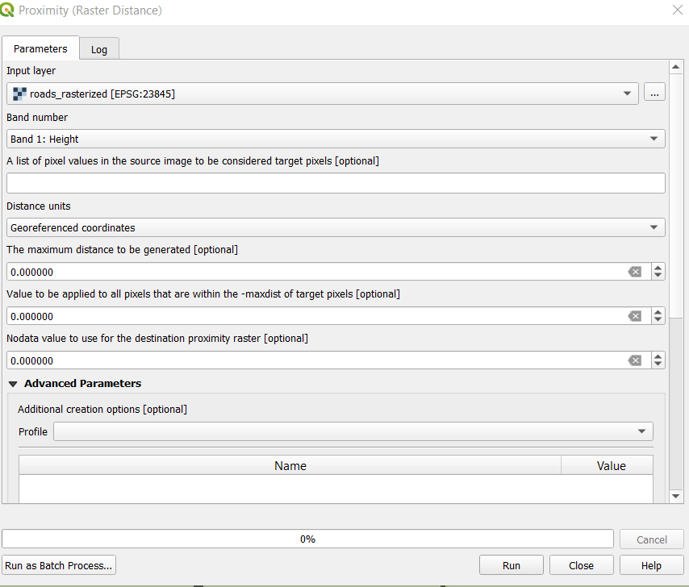

+ Click on the **Run** button.
+ Geopackage the layer and name it **connectingRoads_proximity**

> **Repeat** for the rest of the dataset giving the names to each of the layers as shown below:

Layer to do proximity | Final Layer Name
------------- | ------------- 
disaster_rasterized | disaster_proximity
forest_rasterized | forest_proximity
seaport_rasterized | seaport_proximity
connectingRoads_rasterized | connectingRoads_proximity
airport_rasterized | airport_proximity
settlement_rasterized | settlement_proximity 

### <span style="text-decoration:underline">5.5 Slope calculation</span>
+ From the menu bar, select **Raster → Analysis → Slope.**
+ For **Input layer**, select **DEM_new** from the drop-down list.
+ Click on the **Run** button and **Close** the dialogue window.
+ A temporary layer called **Slope** will be added.
+ Set the resolution to **30m by 30m** resolution. 
+ Geopackage layer and name it **slope30by30**

**To ensure that our slope layer only covers the study area and not the sea boundaries, we will create a dissolve vector layer for the study area.** 

+ From the top menu bar **Vector → Geoprocessing Tool → Dissolve.**
+ Input layer select **east_kalimantan.**
+ Advanced options: **Do not filter (Better performance).**

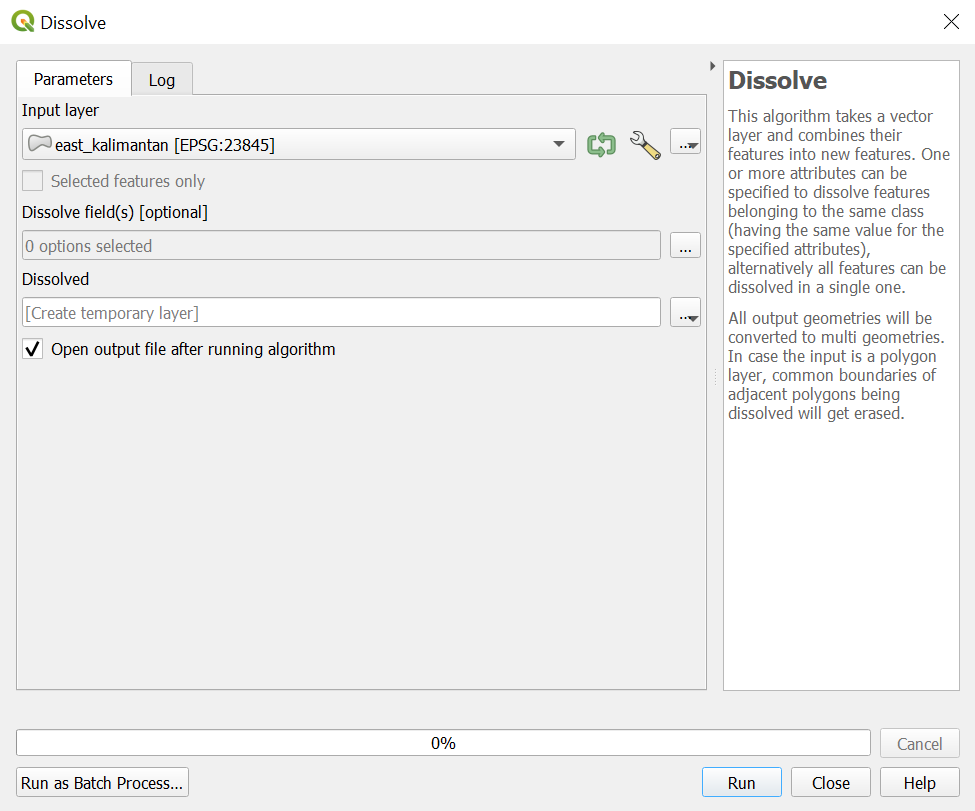

+ Click on the **OK** button.
+ Save to Geopackage name it **StudyAreaSingle.** 

Next, we will clip raster by Mask Layer to get the raster layer of our slope in our study area

+ From the top menu bar, select **Raster → Extraction → Clip Raster** by Mask Layer…
+ Input layer: **slope30by30**
+ Mask layer: **StudyAreaSingle**

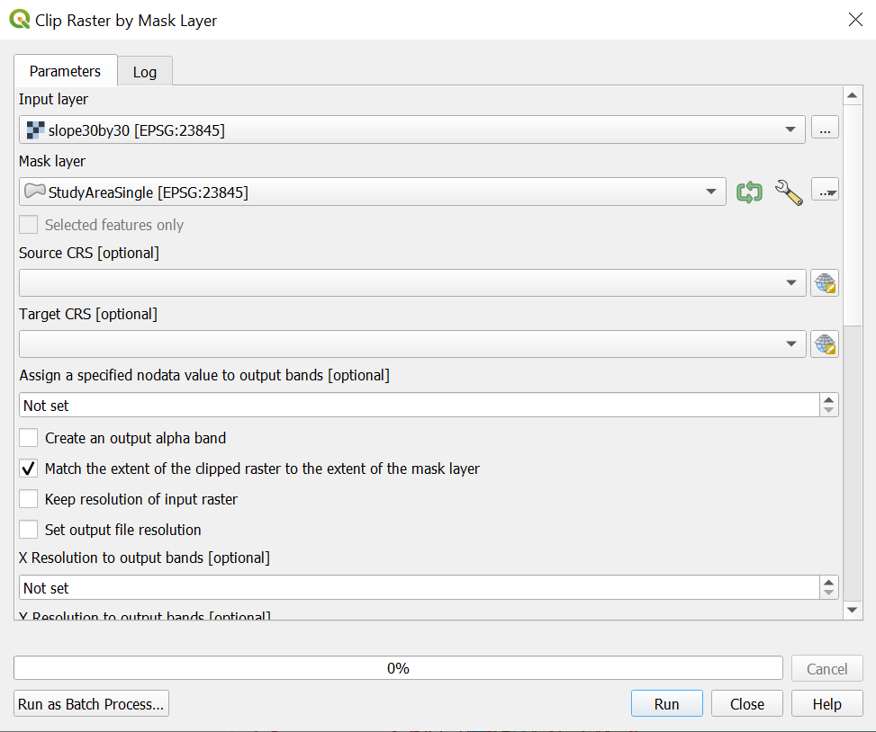

+ Click on **Run** and close the window.
+ Save the Clipped(mask) layer into GeoPackage and change the resolution to **100m by 100m**.
+ Name it as **slopeStudyArea**.

## 6.0 Choosing a suitable site
### <span style="text-decoration:underline">6.1 Standardising the data using Z-Score</span>

We will be using **Raster calculator** to standardise the proximity layers. The following Z-score equation is used for standardisation.

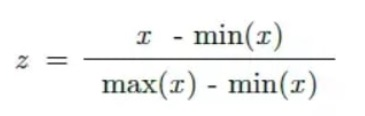

To get the *minimum* and *maximum* values used for standardisation, **right click** on the particular proximity layer, **disaster_proxmity** and navigate to the **Information tab**. The *minimum* and *maximum* values can be found there.  

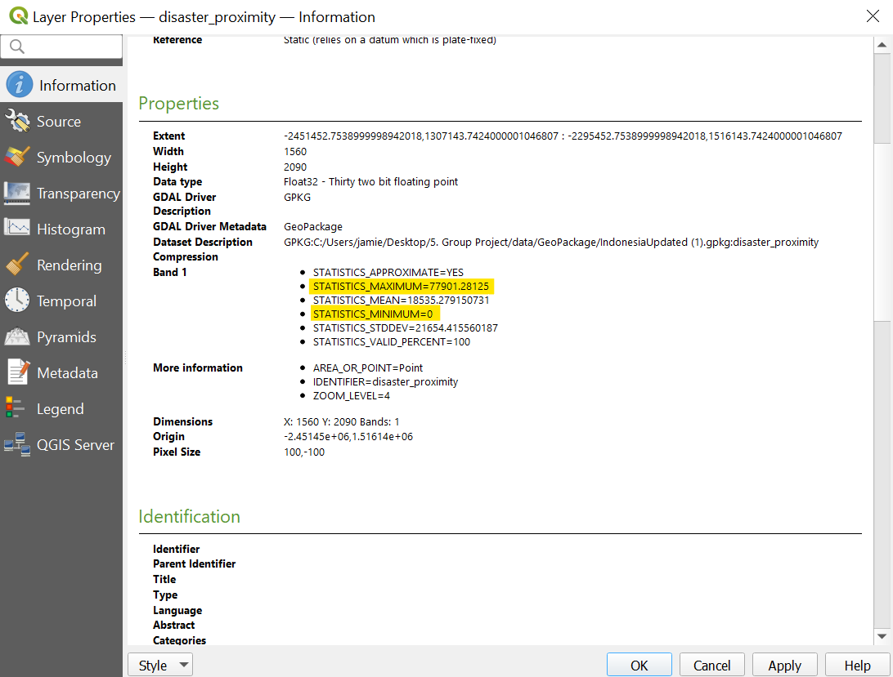

+ From the top menu bar, click on **Process → Toolbox**
+ A side pane will appear on the right.
+ Double click on **Raster calculator**. 

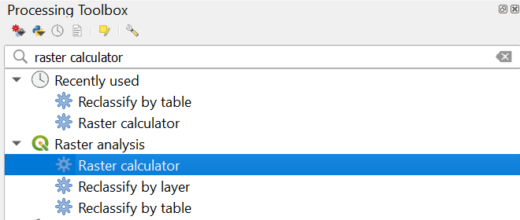

> Use the **standardisation equation** as mentioned above and key it into the **expression pane** as shown in the image below. 

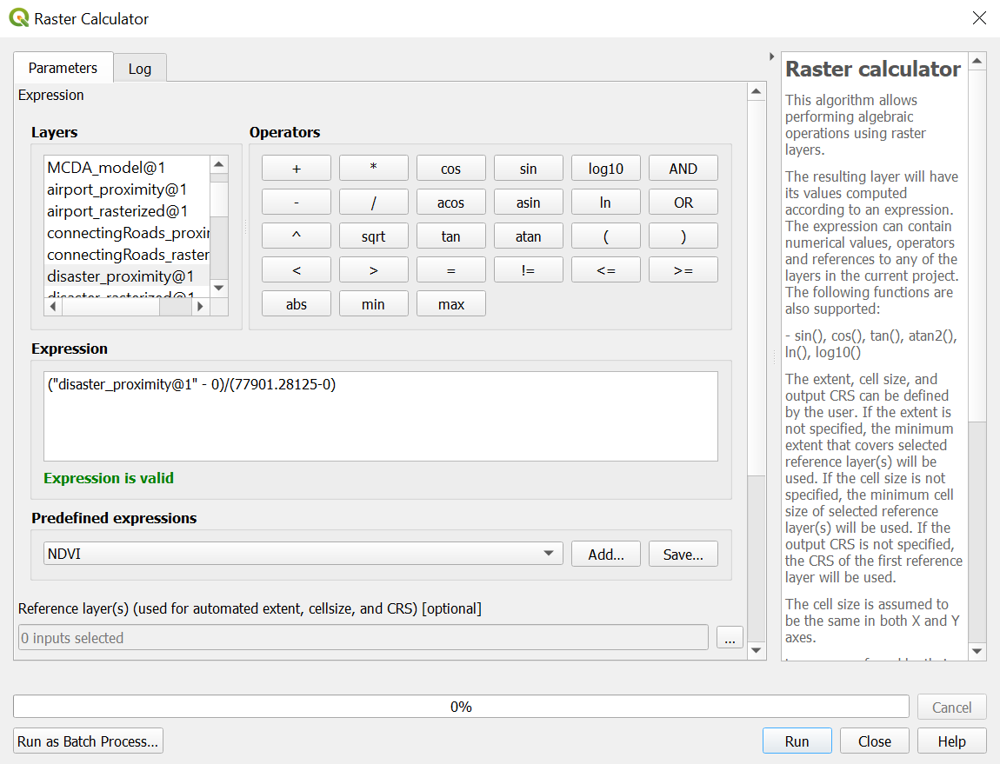

+ Click on the **Run** button and close the window
+ Export the layer as a GeoPacakge and name it **factor_disaster**. 

> **Repeat** this for all other proximity layers\
**Note** that for layers in which we want to be close to, we will inverse the standardisation using **(1 - Zvalue)**. After standardizing, we save the respective results as:

Layer to perform standardization | Inverse (1-Zscore) | Final Layer Name 
------------- | ------------- | ------------- 
disaster_proximity | No | factor_disaster_new
forest_proximity | No | factor_forest
hotspots_heatmap | Yes | factor_hotspot
seaport_proximity | Yes | factor_seaport
connectingRoads_proximity | Yes | factor_connectingRoad
airport_proximity | Yes | factor_airport
slope | Yes | factor_slope
settlement_proximity | Yes | factor_settlement

### <span style="text-decoration:underline">6.2 AHP calculation</span>

Using the Raster calculator, we will now calculate the composite factor score using the following AHP importance ranking and weights. Our team achieved a consistency score of *4%* and thus we will proceed with the following AHP weightage.

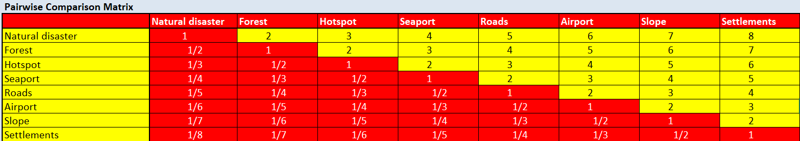

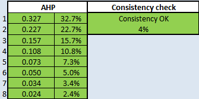

We created the AHP suitability layer with the following calculation: 

> ("factor_disaster_new@1" * 0.327) + 
("factor_forest@1"* 0.227) + ("factor_hotspot@1" * 0.157) + ("factor_seaport@1" * 0.108) + ("factor_connectingRoad@1" * 0.073) + ("factor_airport@1" * 0.05) + ("factor_slope@1" * 0.0340) + ("factor_settlement@1" * 0.024)

+ Our reference layer will be any one of the factor layers that we have 
+ Output CRS will be **EPSG:23845 – DGN95/Indonesia TM-3 zone 54.1**

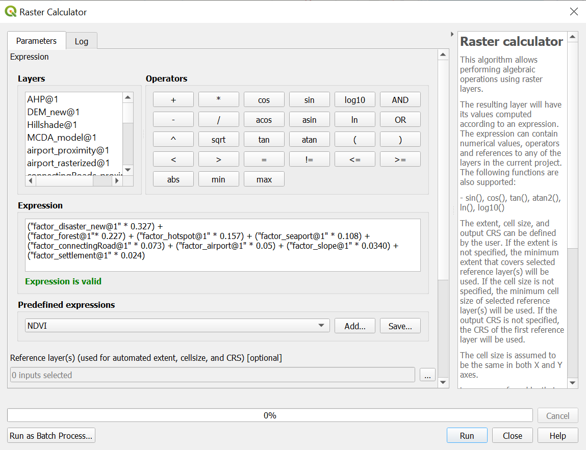

+ Click on **Run** and close the dialogue box after a new temporary layer is created. 
+ Save the temporary layer as a GeoPackage and name it **AHP**.

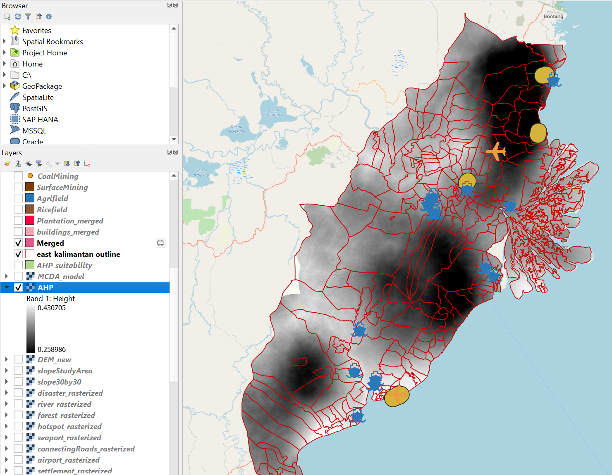


From our analysis we decided that a composite factor score of 0.4 should be used as a cut-off for suitable sites. Now, we will use the function **Reclassify by table** to separate the sites into suitable and not suitable. 

+ From the **Processing Toolbox**, search for **Reclassify by table** and double click on it.

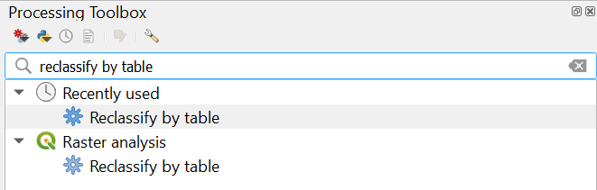

The dialogue box for Reclassify by table will appear.

+ Raster layer: **AHP**
+ Click on the more icon under Reclassification table and enter the following as shown below.

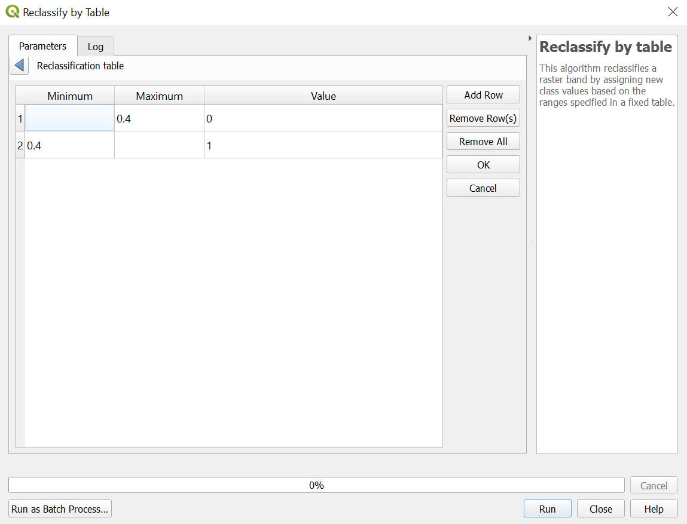

+ Click **OK** to return to the previous screen
+ For range boundaries select: **min <= value < max**
Your dialogue box should look like the screenshot below

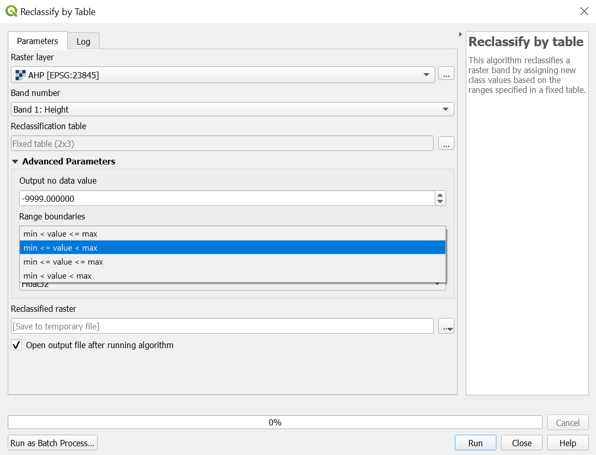

+ Click on **Run** and close the dialogue box. 
+ Save this temporary Reclassified raster layer into the GeoPackage
+ Name this layer **MCDA_model.**

The MCDA_model should look like the screenshot below. White portions indicate suitable sites while black portions indicate non suitable sites.

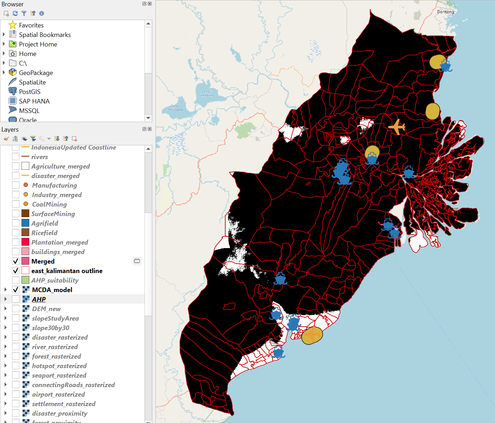

### <span style="text-decoration:underline">6.3 Vectorizing suitable sites</span>

Now we need to convert the MCDA_model raster layer into a vector.

+ From the top menu bar, select **Polygonize (Raster to Vector)**

The Polygonize (Raster to Vector) dialog window appears.

+ For Input Layer, select **MCDA_model** from the drop-down list.
+ For Name of the field to create, type **Sites.**
+ Keep the checkbox in front of Use 8-connectedness **uncheck**.

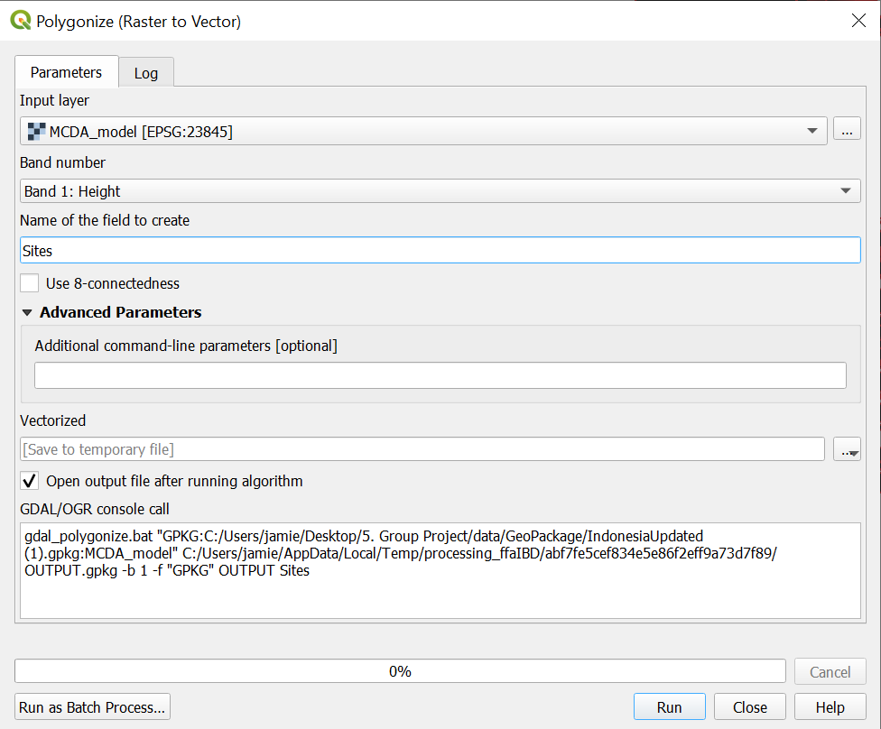

+ Click on **Run** and close the window.
+ A temporary layer called **Vectorized** will be added to the layers panel. 
+ Open the attribute table of this Vectorized layer. 
+ Note that there is a column called Sites with values *0 and 1*.
+ *0* indicates not suitable while *1* indicates suitable.

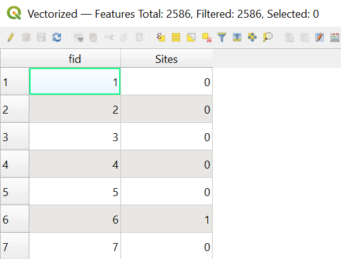

+ Click on **select by expression** and enter the following expression into the expression box.

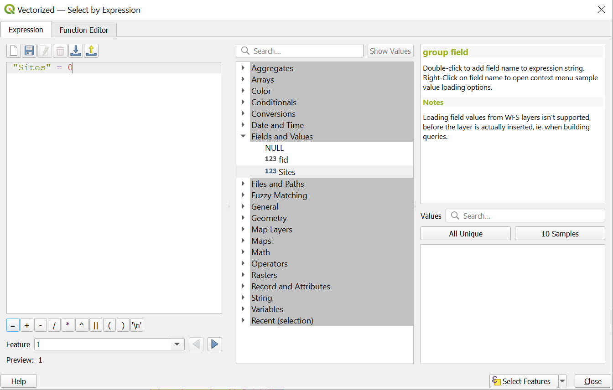

+ The sites which are 0 (not suitable) are selected. 
+ Click on the **Toggle Editing** Button.

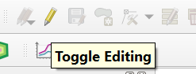

+ Click on **Delete Selected** to remove all the non suitable sites. 

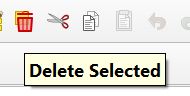

+ Export the layer into a GeoPackage.
+ Name this layer **AHP_suitability.**
+ The suitable sites are the polygons in green as shown in the image below. 

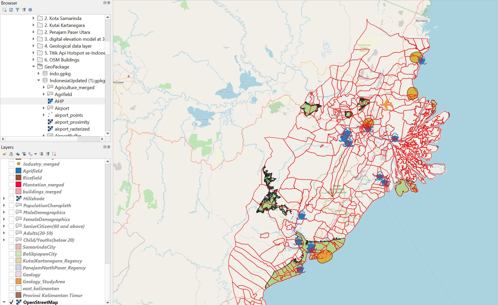

Next, we will need to calculate the area of each polygon.

+ Use the **Field Calculator**
+ Output field name: **Site_area**
+ Output field type: **Decimal number (real)**
+ From the Geometry drop-down menu in the middle column, double click on **$area** to add to the expression pane. 

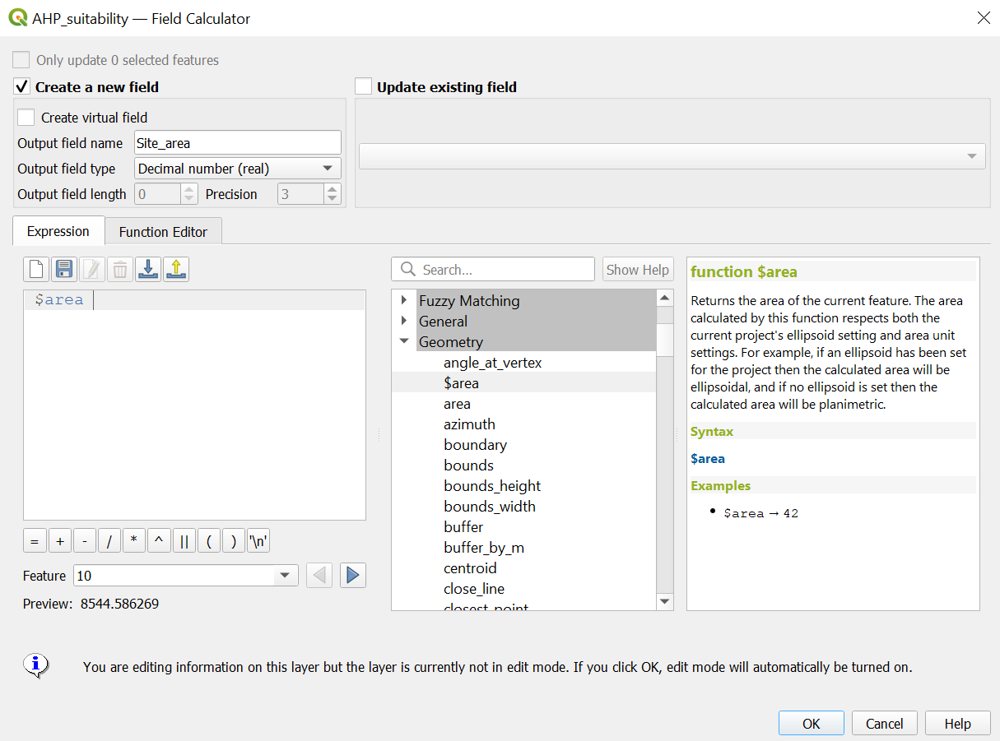

+ Click on **OK.** Note that a new column will be added to the attribute table which includes all the areas of polygons in meters square.
+ However, we want the area to be in **Hectares**. To do this, repeat the above steps to create a new field called **area_hectares.**
+ For area_hectares, the expression should be **$area/10000** instead.

> The **attribute table** should look like this

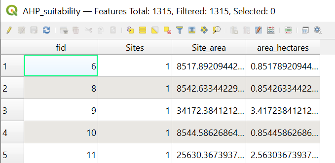

## 7.0 Geopackaged Layers
