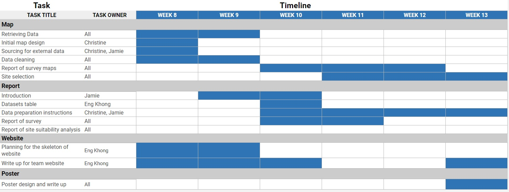

```{r setup, include=FALSE}
knitr::opts_chunk$set(echo = FALSE)
```

# 1.0	Introduction
Indonesia is a country located in Southeast Asia which stretches across the equator and is situated in both the Pacific and Indian Oceans. Consisting of a total of 17,508 islands, Indonesia is the fourth most populated country in the world with a population of 275.1 million people as of mid-2021. Additionally, it is the country with the largest Mulim population in the world, despite it not being an official Islamic state. The capital of Indonesia has been Jakarta since 1945. In 2019, the president of Indonesia, Joko Widodo announced that he plans to relocate the capital of Indonesia to the edge of eastern Borneo island, East Kalimantan. This is due to the fact that "the burden Jakarta is holding right now is too heavy as the centre of governance, business, finance, trade and services." Jarkarta is one of the most densely populated cities in the world with a population of 10 million people. Due to the overcrowding, Jakarta experiences heavy traffic congestion leading to huge economic losses. 


# 2.0 Project Objective

This project aims to plan a new-province level city and to relocate the capital of Indonesia to Kalimantan on the island of Borneo. This is in line with reducing the developmental inequality between java and other islands in the Indonesian archipelago and to reduce Jakarta's burden as Indonesia's Primary hub.
The proposed site of East Kalimantan, is near the regional cities, Balikpapan city and Samarinda city. It is also partly in the North Penajam Paser and Kutai Kartanegara Regencies. In East Kalimantan, more than 50% of the population is employed in the agriculture sector. Additionally, the manufacturing sector is dominated by industries such as logging and mining which has boosted the local economy. There are two airports in this area, one in Balikpapan which handles international flights and a smaller one in Samarinda which handles domestic flights. The president mentioned that the site of East Kalimantan is in a very favorable location as it is in a central location of Indonesia and it is close to urban areas. He also added that the area is at a low risk of natural disasters. Thus, we will be looking into East Kalimantan, specifically Balikpapan city, Samarinda city, North Penajam Paser regency and Kutai Kartanegara regency to propose a potential new site for the new capital of Indonesia. 


#### The project aims to analyse the study area in terms of the following aspects:

+ Population and demographic

+ Economic and Business

+ Transport and Communication

+ Infrastructure

+ Environment and Hazard


#### We will also select a suitable site that meets the following requirements for capital relocation:

+ The proposed new capital city should be between 4500-5500 hectares in size.
       
+ It should avoid steep slope. Steep slope developments are relative more costly because they involve cut-and-fill and is less environmental friendly.
      
+ It should be away from potential natural disaster risk areas such as sea coasts, major rivers and volcanoes.
      
+ It should be near to current urban settlement areas but not at the current major settlement areas.
       
+ It should avoid natural forest as much as possible.
      
+ It should avoid areas prone to forest fire.
       
+ It should be highly accessible via road transport.
       
+ It should be near to airport(s) and seaport(s).


# 3.0 Project Schedule



# 4.0 Data Sources
Data Source | Name | Description | Link
------------- | ------------- | ------------- | -------------
Indonesia Geospatial | BATAS DESA DESEMBER 2019 DUKCAPIL KALIMANTAN TIMUR | Village boundary and population data for East Kalimantan 2019 | https://www.indonesia-geospasial.com/2020/04/download-shapefile-shp-batas-desa.html
Indonesia Geospatial | Geology Kalimantan Timur | Geology Shapefile of East Kalimantan | https://www.indonesia-geospasial.com/2020/03/download-data-shapefile-shp-geologi-se.html 
Indonesia Geospatial |KOTA BALIKPAPAN | Topographical data layers of Balikpapan City | 	https://www.indonesia-geospasial.com/2020/01/shp-rbi-provinsi-kalimantan-timur.html
Indonesia Geospatial | KOTA SAMARINDA | Topographical data layers of Samarinda City | 	https://www.indonesia-geospasial.com/2020/01/shp-rbi-provinsi-kalimantan-timur.html
Indonesia Geospatial | KUTAI KARTANEGARA | Topographical data layers of Kutai Kartanegara Regency | 	https://www.indonesia-geospasial.com/2020/01/shp-rbi-provinsi-kalimantan-timur.html
Indonesia Geospatial | 	OSM Buildings | Detailed building footprints throughout Indonesia | https://www.indonesia-geospasial.com/2020/12/download-shp-pemukiman-detail-seluruh.html
Indonesia Geospatial | PENAJAM PASER UTARA | Topographical data layers of Penajam Paser Regency | https://www.indonesia-geospasial.com/2020/01/shp-rbi-provinsi-kalimantan-timur.html
Indonesia Geospatial | 30. Provinsi Kalimantan Timur | Digital elevation model at 30m resolution | https://www.indonesia-geospasial.com/2020/01/download-dem-srtm-30-meter-se-indonesia.html
Indonesia Geospatial | Titik Api Hotspot se-Indonesia Tahun 2014 - 2019  | Indonesia fire Hotspot data from 2014-2019 | https://www.indonesia-geospasial.com/2020/04/shapefile-shp-titik-api-hotspot.html
