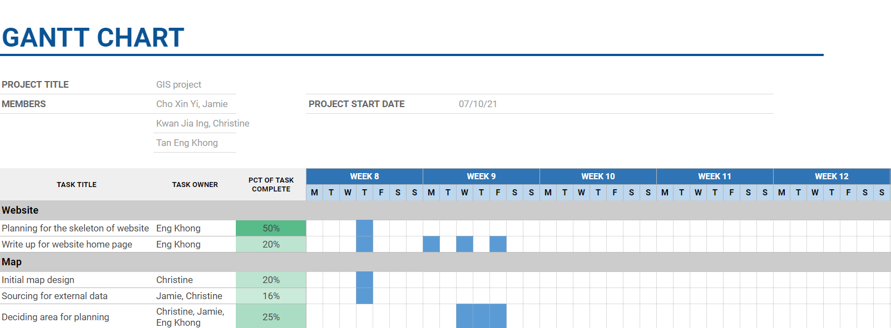

```{r setup, include=FALSE}
knitr::opts_chunk$set(echo = FALSE)
```

# 1.0	Introduction
This project aims to plan a new-province level city and to relocate the capital of Indonesia to Kalimantan on the island of Borneo. This is in line with reducing the developmental inequality between java and other islands in the Indonesian archipelago and to reduce Jakarta's burden as Indonesia's Primary hub.

Our team is deeply honored to be given this opportunity to put our Geospatial knowledge to good use by working with our client in finding a suitable site for the relocation using site suitability analysis. 


# 2.0 Project Objective
The project aims to analyse the study area, East Kalimantan in terms of the following aspects:

+ Population and demographic

+ Economic and Business

+ Transport and Communication

+ Infrastructure

+ Environment and Hazard


We will also select a suitable site that meets the following requirements for capital relocation:

+ The proposed new capital city should be between 4500-5500 hectares in size.
       
+ It should avoid steep slope. Steep slope developments are relative more costly because they involve cut-and-fill and is less environmental friendly.
      
+ It should be away from potential natural disaster risk areas such as sea coasts, major rivers and volcanoes.
      
+ It should be near to current urban settlement areas but not at the current major settlement areas.
       
+ It should avoid natural forest as much as possible.
      
+ It should avoid areas prone to forest fire.
       
+ It should be highly accessible via road transport.
       
+ It should be near to airport(s) and seaport(s).


# 3.0 Project Schedule
```{r layout="l-body-outset"}

```

# 4.0 Data Sources
Data Source | Name | Description | Link
------------- | ------------- | ------------- | -------------
Indonesia Geospatial | BATAS DESA DESEMBER 2019 DUKCAPIL KALIMANTAN TIMUR | Village boundary and population data for East Kalimantan 2019 | https://www.indonesia-geospasial.com/2020/04/download-shapefile-shp-batas-desa.html
Indonesia Geospatial | Geology Kalimantan Timur | Geology Shapefile of East Kalimantan | https://www.indonesia-geospasial.com/2020/03/download-data-shapefile-shp-geologi-se.html 
Indonesia Geospatial |KOTA BALIKPAPAN | Topographical data layers of Balikpapan City | 	https://www.indonesia-geospasial.com/2020/01/shp-rbi-provinsi-kalimantan-timur.html
Indonesia Geospatial | KOTA SAMARINDA | Topographical data layers of Samarinda City | 	https://www.indonesia-geospasial.com/2020/01/shp-rbi-provinsi-kalimantan-timur.html
Indonesia Geospatial | KUTAI KARTANEGARA | Topographical data layers of Kutai Kartanegara Regency | 	https://www.indonesia-geospasial.com/2020/01/shp-rbi-provinsi-kalimantan-timur.html
Indonesia Geospatial | 	OSM Buildings | Detailed building footprints throughout Indonesia | https://www.indonesia-geospasial.com/2020/12/download-shp-pemukiman-detail-seluruh.html
Indonesia Geospatial | PENAJAM PASER UTARA | Topographical data layers of Penajam Paser Regency | https://www.indonesia-geospasial.com/2020/01/shp-rbi-provinsi-kalimantan-timur.html
Indonesia Geospatial | 30. Provinsi Kalimantan Timur | Digital elevation model at 30m resolution | https://www.indonesia-geospasial.com/2020/01/download-dem-srtm-30-meter-se-indonesia.html
Indonesia Geospatial | Titik Api Hotspot se-Indonesia Tahun 2014 - 2019  | Indonesia fire Hotspot data from 2014-2019 | https://www.indonesia-geospasial.com/2020/04/shapefile-shp-titik-api-hotspot.html
