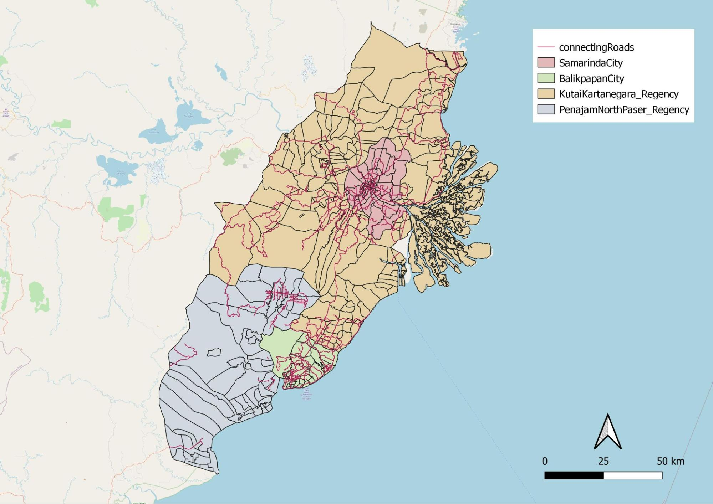
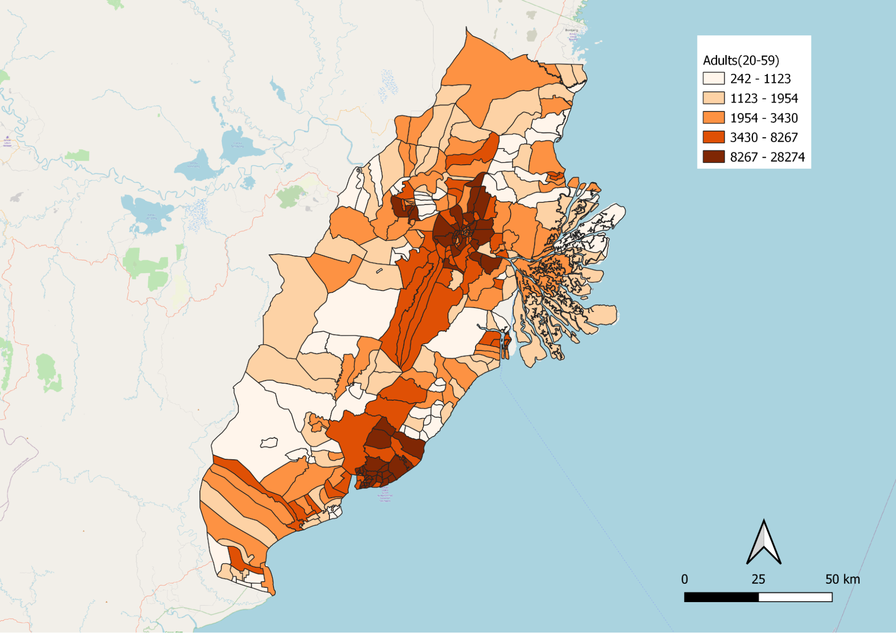
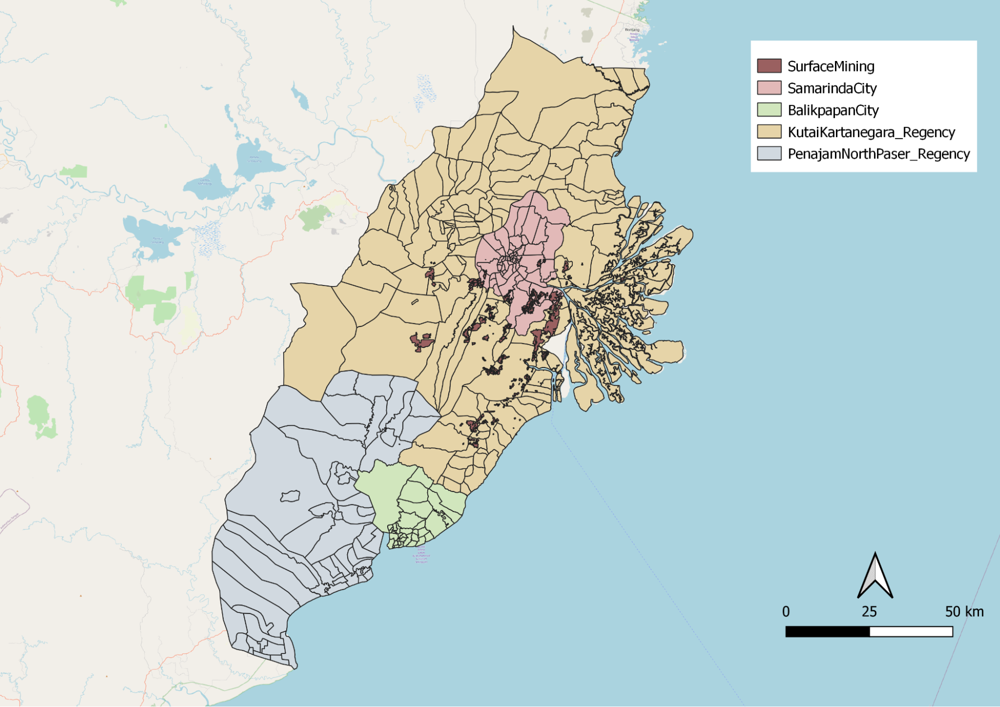
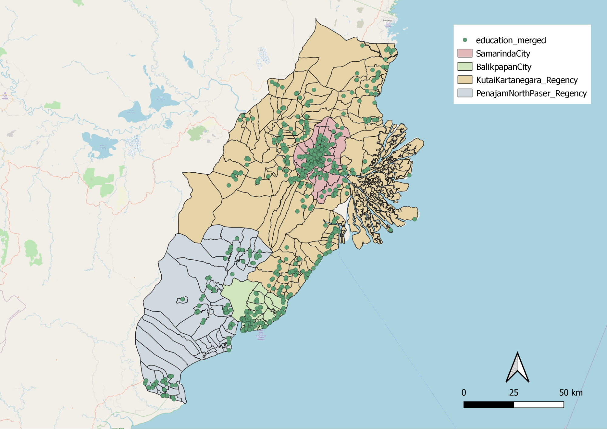
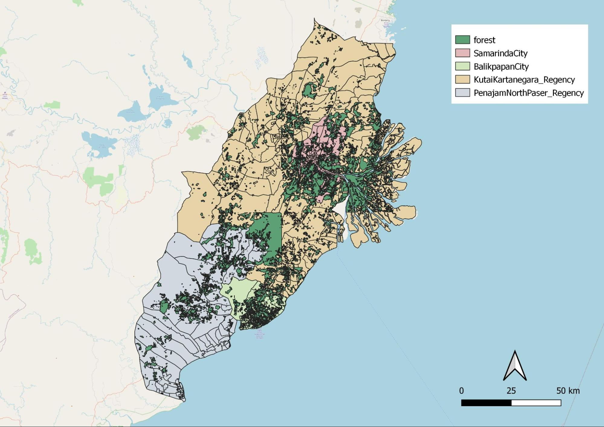

```{r, include=FALSE}
knitr::opts_chunk$set(echo = FALSE,
                      warning = FALSE,
                      tidy = FALSE,
                      message = FALSE,
                      fig.align = 'center',
                      out.width = "100%")
options(knitr.table.format = "html") 
```

<br> <font size="4"> </center>
# Issues & problems
<center> </font>
Indonesia is not uniformly developed. Additionally, Jakarta is strained being the sole primary hub. 

<font size="4"> </center>
# Motivation
<center> </font>
To reduce the developmental inequality and Jakarta's burden as Indonesia's primary hub, we carry out suitable analyses to locate a new province-level planned capital city. 

<font size="4"> </center> 
# Approach
<center> </font>

1. Isolate study area from East Kalimantan
2. Select relevant factors (report of survey) for consideration
3. Rasterize and vectorize relevant factors 
4. Perform AHP analysis 
5. Select most relevant site from results

<font size="4"> </center> 
# Study area
<center> </font>
{width=90%} 
 <font size="4"> </center>

# Transport & communication 
<center> </font> {width=100%} </center>
Highest concentration of major roads are found within Balikpapan city and Samarinda city which indicates these cities have a larger concentration of transportation facilities as compared to the regencies. 


<center> {width=100%} </center> The different modes of transportations, airports, seaports and bus terminals are mostly situated within or near Balikpapan city and Samarinda city. This suggest that both city centers are highly connected by various modes of transportations. 


<font size="4"> </center> 
# Population & demographic
<center> </font> {width=90%} </center> <br> This group of people is vital for national progression as they are working individuals. Darker shaded areas have a denser population. This is well explained as Samarinda and Balikpapan are both city centers, signifying more job opportunities for career advancement.

<font size="4"> </center>
# Economic & business
<center> </font> {width=90%} </center>
<center> {width=90%} </center>
The dataset contains coal mining, surface mining and other mining. Land used from mining activities could be a consideration when selecting the area for the city as it would involve additional economic cost to rehabilitate lands.

<font size="4"> </center> 
# Infrastructure
<center> </font> {width=90%} </center> These are essential services as they prevent diseases, improve wellbeing and quality of life for citizens. Choosing a site nearer to polygons with more healthcare facilities will be ideal. 
<center> {width=90%} </center> Educational institutions are not evenly distributed. Kota Samarinda and the coastline of Kota Balikpapan are densely populated with educational institutions. This might be due to the higher population density in those areas.
<center> {width=90%} </center> Electrical towers are not evenly spread out. This could be due to the fact that Kota Samarinda is the capital, and more modern buildings are located there. 

<font size="4"> </center> 
# Environment & hazard
<center> </font> {width=90%} </center> <br> It is observed that hotspot points are consistently scattered throughout the whole study area. When choosing the capital area, we should avoid these spots as much as possible. 
<center> {width=90%} </center> <br> Climate change is a real problem, we should preserve forests as and when we can. By choosing a site that is far from forests, it reduces the need for deforestation, thus preserving the environment. 
<center> {width=90%} </center> <br> Tsunamis are prevalent in Indonesia. By avoiding coastlines, we are mitigating the chances of high casualties and fatalities should a tsunami take place. 


```{r, include=FALSE}
knitr::write_bib(c('posterdown', 'rmarkdown','pagedown'), 'packages.bib')
```

<font size="4"> </center>
# Site selection
<center> </font> {width=80%} </center> <br>
<center> {width=90%} </center> <br>
<center> {width=90%} </center> <br>

After standarizing and rasterizing with the z-formula below, we created an AHP site suitability layer with the AHP values with a consistency check of 4%. 

$$
z = 
\frac{x - min(x)}{max(x) - min(x)}
$$
We continued to narrow down the sites from AHP suitability layer by selecting sites that meet the 4500 to 5500 hectare requirement, and we were left with 2 sites to choose from. The following comparison table shows our thought process for evaluating the 2 sites. 

<center> {width=90%} </center> <br>

Since site 1 has more highlighted boxes, it shows that site 1 is more favorable. Hence, our chosen site. 

<font size="4"> </center>
# Future work
<center> </font> 
QGIS has proven to be a powerful and cost effective application for analysts. With many plugins in their repository, we are able to manipulate data and produce web pages for professional use.

Narrowing down such a huge map to several sites has been challenging. It is important to first identify constraints and limitations when performing map study. We could have also analysed additional factors such as gross domestic product (GDP) and potential business ventures that Indonesia can undertake to make sure their new province thrives. For instance, by planning out what new activities the selected site could do will create clear goals when building its infrastructure.

As our AHP consistency score is 4%, we could have tried out more AHP permutations to get an even lower consistency score. This would provide us even more suitable sites for analysis. 

Additionally, it would be good if we were able to get external help from someone fluent in Bahasa Indonesia. As attributes in the data are mainly in that language, we were unable to translate all attributes accurately due to the language barrier. Therefore, there might be minor inconsistencies as we might have missed a few layers, which might have affected the final AHP site suitability results. 

In future, we hope that the skills we gained from Geographic Information Systems for Urban Planning will be put to good use, so that we can derive deeper insights for better urban planning and analysis.


<br><center> <font size="7"> **THANK YOU**  </font> </center>