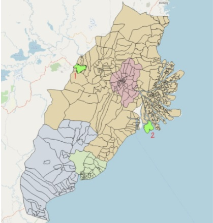

```{r setup, include=FALSE}
knitr::opts_chunk$set(echo = FALSE)
```
# 1.0 Site Selection

## 1.1 Preliminary Analysis: Geology Layer


<p align = "center">
*Figure 1: Distribution of Volcanoes in East Kalimantan*
</p>

***Legend:***

  + **Yellow**: Volcanic areas
  + **Red Outline:** Study area
  + **Pink:** Geology overview in East Kalimantan
  
In our site selection, we looked for potential natural disaster risk areas such as sea coasts, major rivers and volcanoes. Upon analysis, we found out that there were no volcanoes within our study area as indicated in the image above. Therefore, the study area is safe from volcanic hazards and activity. 

## 1.2 AHP Analysis

Before performing site selection, we will have to first conduct Analytical Hierarchical Process (AHP) analysis to determine which criterias should be prioritized for decision making. 

By keeping the following goal in mind, we will explain our reasons for choosing the weightings for each criteria. 

+ Goal: To create a new **province-level planned city**, and the capital will be relocated to a more central location within Indonesia. The plan is part of a strategy to reduce developmental inequality between Java and other islands in the Indonesian archipelago and to reduce Jakarta’s burden as Indonesia’s primary hub. 

A primary hub is defined as a main hub for airlines. By operating an additional hub, it will take away the pressure from Jakarta being the sole primary hub in Indonesia. The implementation of a new hub will bring in more business to Indonesia, boosting tourism and export sectors. 


<p align = "center">
*Figure 2: AHP scores*
</p>


<p align = "center">
*Figure 3: Pairwise comparison matrix*
</p>

We set n = 8 for the number of factors to be used in our AHP calculation and ranked these factors in decreasing order of importance. The final consistency showed a result of 4% which we thought was a suitable score. We used these values to compute the AHP site suitability layer in our QGIS project. Additionally, we took into account the amount of data we have for each of the factors, as a lack of data will not produce an accurate site suitability result. We will now justify why we think each factor should be ranked as so. The factors and our respective rankings are:


<ol>
  <li>**Natural Disaster**
      <ol>
      <li type="i">Since the main goal of choosing a site is to create a new province-level city, we feel the most important factor for consideration is safety since many people will be visiting or permanently staying in this area. Should there be any natural catastrophes, casualties will be high. </li>
      <li type="i">We will be analysing this by looking at coastlines and rivers.</li>
    </ol>
  </li>

  <li>**Forest**
        <ol>
      <li type="i">If the chosen area is near forests, a lot of land pre-planning will need to be done. Especially in a time where global warming is a real issue, we should not support more deforestation for industrial purposes. To preserve the environment, we should select areas that are more barren. </li>
      <li type="i">We will analyse this by comparing site areas with OpenStreetMap. </li>
    </ol>
  </li>
  
  
  <li>**Forest fire**
        <ol>
      <li type="i">Forest fire can also be seen as a type of natural disaster. However, it is more predictable. It can be gauged through ambient temperatures. It is still very dangerous as the fumes resulting from forest fires can negatively impact the health of citizens. It also kills off the flora and fauna. We also have many data points on forest fires, which is why we think that ranking it first will be significant, as we need to avoid hotspot points. </li>
      <li type="i">We will be analysing this through forest hotspots from our datasets. </li>
    </ol>
  </li>
  
  
  <li>**Seaport**
        <ol>
      <li type="i">Indonesia is the world’s largest exporter of mining resources. Therefore, we conclude it  is more important than airports since mining resources are generally transported with cargo ships. An article reported that “With exports of oil, gas and coal steadily increasing, the province was responsible for a major portion of the country’s export output with a value of US$37.97 billion. As of October 2012, its export output value stood at $27.71 billion.” Furthermore, Balikpapan is labelled as “a seaport city on the east coast of East Kalimantan,” meaning that they rely more heavily on seaports. (International Trading Institute, n.d.) </li>
      <li type="i">We will analyse this through rasterized points of seaports. This is because we lack the polygon representation of seaport polygons. </li>
    </ol>
  </li>
  
  <li>**Road transport**
        <ol>
      <li type="i">We ranked this after airport/seaport because airports and seaports help connect Indonesia to the world. Road transport is more so for domestic travelling purposes. It is still important as citizens need to be able to efficiently move within the country. </li>
      <li type="i">We will be analysing this through the rasterized layer for road transport. </li>
    </ol>
  </li>

  <li>**Airport**
        <ol>
      <li type="i">Airports are still important because they bring in tourists to Indonesia. This boosts Indonesia’s economy. Additionally, they can also be used to export sensitive and perishable goods. </li>
      <li type="i">We will analyse this through rasterized polygons for airports. Polygons are more accurate. </li>
    </ol>
  </li>
  
  <li>**Slope**
        <ol>
      <li type="i">Although it is important to note that our selected site should avoid steep slopes due to higher development cost from the involvement of more cut-and-fill, we felt that slope does not outweigh the above mentioned factors. </li>
      <li type="i">We will analyse this using the slope layer that we created so that we can analyze steep slope areas to avoid. </li>
    </ol>
  </li>
  
  <li>**Settlement**
        <ol>
      <li type="i">By planning a provincial area, many people would flock to this area to live since it is accessible. Hence, a suitable area would be one near current urban settlement areas and not major ones which are already densely populated. </li>
      <li type="i">We will be analysing this through the use of a choropleth map created with population attributes. Additionally, we will cross reference with Indonesia's OpenStreetMap to analyze the complexity of buildings. 
 </li>
    </ol>
  </li>  
</ol>

## 1.3 Narrowing down the suitable sites


<p align = "center">
*Figure 4: Suitable sites*
</p>

After performing AHP analysis, we have derived a layer with suitable sites highlighted in green as shown in *figure 4*. To narrow down these areas, we first check if each of these suitable sites meet the size requirements. As we have calculated the area of each of these polygons in hectares, we can simply use the identify tool to confirm whether or not the polygons are within 4500 to 5500 hectares. 


<p align = "center">
*Figure 5: Selecting polygons with appropriate size*
</p>



<p align = "center">
*Figure 6: Polygons with appropriate size*
</p>

By using the select expression function, we can key in the following to determine which polygons meet the size criteria. As seen in figure 6, we have narrowed down the suitable sites to just 2 locations.  For simplicity purposes, we will be calling the site on the **far left “1”** and the site on the **far right “2”.**

## 1.4 Comparing the sites


<p align = "center">
*Figure 7: Sites and natural disaster*
</p>

While both sites are relatively far away and safe from fire hotspots, site 1 is more preferable as it is away from the coastlines and rivers. 


<p align = "center">
*Figure 8: Sites and forests*
</p>

Both sites are far away from forests. However, site 2 has more forest surrounding it. This may mean that the forests have to be cleared to improve accessibility to that area. Therefore, site 1 is more favourable. 


<p align = "center">
*Figure 9: Sites and hotspots*
</p>

From *Figure 9*, Both sites are safe from fire hotspots as they are far away from them. 


<p align = "center">
*Figure 10: Sites and seaports*
</p>

From *Figure 10*, Site 2 is more favourable as it is nearer to seaports. This allows for more efficient transportation as workers in site 2 will not have to travel as much to get to seaports. 


<p align = "center">
*Figure 11: Sites and road transport*
</p>

From *Figure 11*, the lines in red show connecting roads for East Kalimantan. Site 2 does not have any connecting roads leading to it, which makes it inaccessible. This might also be due to the face that the entrance to site 2 is blocked by forests as shown in figure 11. 


<p align = "center">
*Figure 12: Sites and road transport*
</p>

Both sites are not very near to the airport points. However, because site 2 does not have connecting roads, it makes it even more difficult to access airports. Therefore, site 1 is preferred. 


<p align = "center">
*Figure 13: Sites and slope*
</p>

From *Figure 13*, White areas represent steeper slopes compared to darker areas. Based on this map, site 2 is more preferred because it has a gentler slope. Places with steeper slopes result in higher development cost due to the cut and fill. 


<p align = "center">
*Figure 14: Sites and settlements*
</p>

As part of the requirements, the site should be near urban settlement areas but not located directly at major settlement areas. This is true for both sites as they are not currently in highly populated areas. However, in terms of accessibility, site 1 is preferred as it has connecting roads, making it nearer to current settlement areas as compared to site 2. The ease of access thereby makes site 1 “nearer” to these settlements.

## 1.5 Site overview and conclusion

The table below shows our thought process. By comparing both sites with each attribute, we are able to find the most optimal solution.The underlined column represent the site with the more preferred characteristic.

**Site** | **1** | **2** 
------------- | ------------- | ------------- 
**Natural disaster** | <span style="text-decoration:underline">Far away from coastline and rivers</span> | Closer to coastline and rivers
**Forest** | <span style="text-decoration:underline">No forest blocking entrance to the area </span> | Forest blocking entrance to area
**Forest fire** | <span style="text-decoration:underline">Far away from hotspots </span> | <span style="text-decoration:underline">Far away from hotspots </span>
**Seaport** | Further from seaports | <span style="text-decoration:underline">Nearer to seaports </span>
**Road transport** | <span style="text-decoration:underline">More accessible </span> | Less accessible
**Airport** | <span style="text-decoration:underline">More accessible to airports </span> | Less accessible to airports
**Slope** | Steeper slope | <span style="text-decoration:underline">Gentler slope </span>
**Settlement** | <span style="text-decoration:underline">Nearer to settlement areas </span> | Further from settlement areas
**Size** | <span style="text-decoration:underline"> 5452 hectares </span> | 5373 hectares
**Total Underlined** | 7 | 3

Apart from size, all other factors in the table are ranked in order of decreasing weight as per our AHP analysis. Hence, attributes higher up should be prioritized for consideration. For example, even though site 2 has a gentler slope, selecting site 2 will lead to tradeoffs such as lower accessibility and higher chances of fatalities due to it being prone to natural disasters. 


<p align = "center">
*Figure 15: Final selected site*
</p>

In totality, site 1 has 7 preferred attributes while site 2 only has 3. Therefore, site 1 is our chosen site as shown in figure 36.

## 1.5 Future Work and Conclusion

QGIS has proven to be a powerful and cost effective application for analysts. With many plugins in their repository, we are able to manipulate data and produce web pages for professional use.

Narrowing down such a huge map to several sites has been challenging. It is important to first identify constraints and limitations when performing map study. We could have also analysed additional factors such as gross domestic product (GDP) and potential business ventures that Indonesia can undertake to make sure their new province thrives. For instance, by planning out what new activities the selected site could do will create clear goals when building its infrastructure.

As our AHP consistency score is 4%, we could have tried out  more AHP permutations to get an even lower consistency score. This would provide us even more suitable sites for analysis. 

Additionally, it would be good if we were able to get external help from someone fluent in Bahasa Indonesia. As attributes in the data are mainly in that language, we were unable to translate all attributes due to the language barrier. Therefore, there might be minor inconsistencies as we might have missed a few layers, which might have affected the final AHP site suitability results. 

In future, we hope that the skills we gained from Geographic Information Systems for Urban Planning will be put to good use, so that we can derive deeper insights for better urban planning and analysis.

## 1.6 References

<div style="padding-left: 4em; text-indent: -4em;">

<p>Edu-tourism in tropical agricultural system - UGM Indonesia. (n.d.). Retrieved November 14, 2021, from http://www.faperta.ugm.ac.id/newbie/en/headlines/tourist_course.php.</p>
<p>Encyclopædia Britannica, inc. (2019, July 1). East Kalimantan. Encyclopædia Britannica. Retrieved November 14, 2021, from https://www.britannica.com/place/East-Kalimantan.</p>
<p>Indonesia - insights into the coal mining, port and Shipping Industries. Eye on Asia. (n.d.). Retrieved November 14, 2021, from https://www.eyeonasia.gov.sg/asean-countries/share/what-young-people-say/indonesia-insights-into-coal-mining-port-shipping-industries/.</p>
<p>Indonesia. ASEAN IP. (n.d.). Retrieved November 14, 2021, from https://www.aseanip.org/Resources/ASEAN-IP-Offices-Details/Indonesia.</p>
<p>Indonesian president announces site of new capital on Borneo Island. CNA. (2019, August 26). Retrieved November 14, 2021, from https://www.channelnewsasia.com/asia/indonesia-picks-borneo-island-as-site-of-new-capital-joko-widodo-868046.</p>
<p>O'Neill, A. (2021, August 17). Countries with the largest population 2021. Statista. Retrieved November 14, 2021, from https://www.statista.com/statistics/262879/countries-with-the-largest-population/.</p>
<p>Statista Research Department. (2021, September 27). Indonesia: East Kalimantan GDP distribution. Statista. Retrieved November 14, 2021, from https://www.statista.com/statistics/1092835/indonesia-east-kalimantan-gdp-distribution/.</p>
<p>Wolters, O. W. (2021, November 12). Indonesia. Encyclopædia Britannica. Retrieved November 14, 2021, from https://www.britannica.com/place/Indonesia.</p> 
</div>