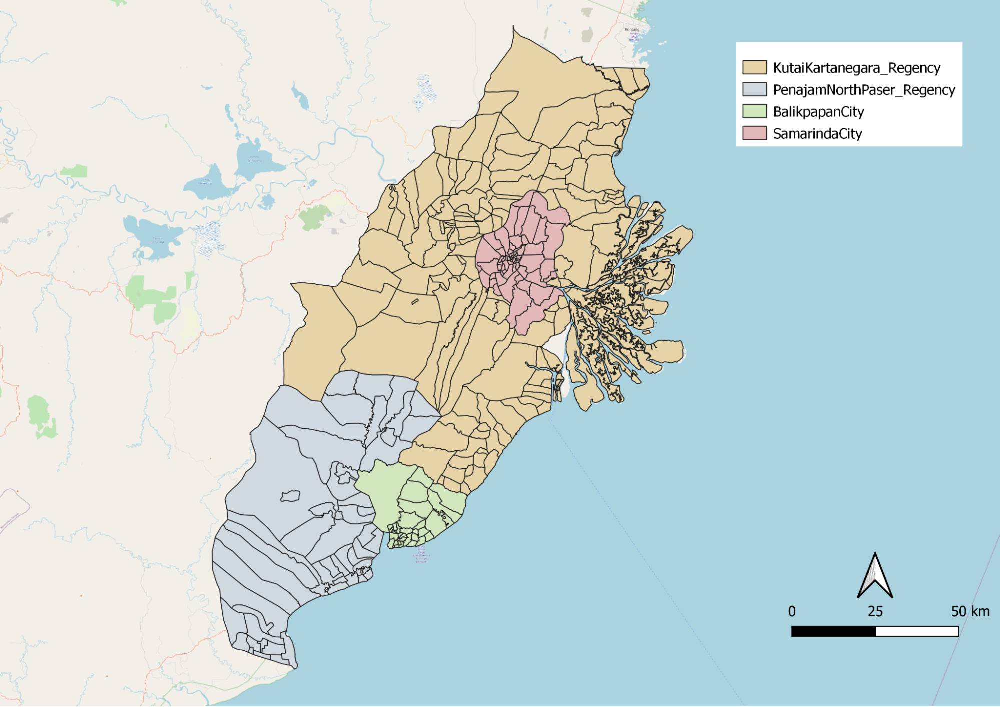
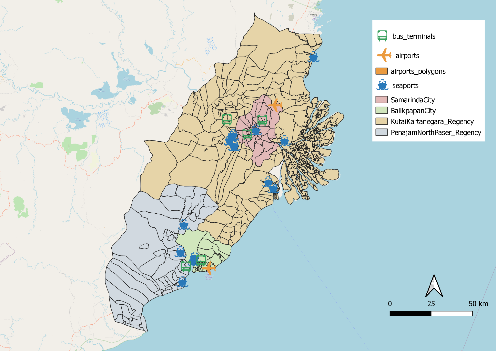
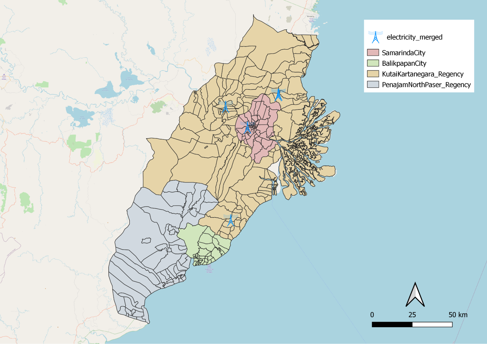

```{r setup, include=FALSE}
knitr::opts_chunk$set(echo = FALSE)
```

## 1.0 Report of Survey
In this section, we will be analyzing the study area according to the following themes

+ Population and Demographics
+ Economic and Businesses
+ Transport and Communication
+ Infrastructure
+ Environment and Hazard

We will be using OpenStreetMap (OSM) to compare data points and polygons to actual land infrastructure and facilities to facilitate accuracy in our analysis. 



<p align = "center">
*Figure 1: Map of study Area*
</p>

## 1.1 Population Density and Demographics
### <span style="text-decoration:underline">1.1.1 Population Density</span>


<p align = "center">
*Figure 2: Population Density Map of Study Area*
</p>

As our group is looking for a suitable site, we consider the population density across each sub district as one of the important factors to analyze the site suitability. Thus, using the data found in Balikpapan city, Samarinda city, North Penajam Paser regency and Kutai Kartanegara regency, we merge them altogether to map out our population density choropleth map. One interesting finding was that in city sub-districts such as Samarinda and Balikpapan, the population density tends to be higher, between 2324 to 28047 per sub district boundary. Contrastingly, we see a smaller population density across most of North Penajam Paser regency and Kutai Kartanegara regency sub-districts. 

### <span style="text-decoration:underline">1.1.2 Gender Distribution</span>


<p align = "center">
*Figure 3: Male Demographics Distribution along study area*
</p>


<p align = "center">
*Figure 4: Female Demographics Distribution along study area*
</p>


<p align = "center">
*Figure 5: Gender Distribution along study area*
</p>

From *Figures 3, 4 and 5* above, we observed that the distribution of male to female in our study area remains somewhat equal with both showing the same gender distribution. One notable difference between figure 3 and 4 is that in Cities like Samarinda and Balikpapan, there is a higher concentration of males and females which further substantiates our earlier discussion that population density is higher in city subdistricts. 

### <span style="text-decoration:underline">1.1.3 Distribution by age</span>


<p align = "center">
*Figure 6a: Distribution of Adults aged 20-59 along study area*
</p>

From the choropleth map shown in *Figure 6a*, we observed that a large proportion of adults are heavily concentrated around city centres like Kota Samarinda and Kota Balikpapan. This group of people is representative in terms of job opportunities and advancement for that particular state. We know that there are more job opportunities available in city centers which explains the higher representation of population in both Samarinda and Balikpapan. Furthermore, we also observed that the adult population across the Kutai Kartanegara Regency and Penajam North Paser Regency are significantly less concentrated as some of those areas are heavily related to agricultural activities. 


<p align = "center">
*Figure 6b: Distribution of Senior Citizens aged 60 and above along study area*
</p>

From the choropleth map shown in *Figure 6b*, we observed a similar trend where senior citizens aged 60 and above are heavily concentrated around city centres like Kota Samarinda and Kota Balikpapan. This can be attributed to reasons such as proximity to healthcare facilities, where healthcare facilities are more accessible in city centres as compared to the outskirts of the study area. In figure 6b above, we observed that hospitals are mostly situated in Samarinda and Balikpapan city, and there is a lack of healthcare facilities found in Kutai Kartanegara Regency and PenajamNorthPaser Regency. Thus, this relationship between proximity to hospital facilities and population within the senior citizens demographics are highly correlated. 

## 1.2 Economic and Businesses


<p align = "center">
*Figure 7: East Kalimantan GDP distribution by sector*
</p>

Indonesia is the largest palm oil producer in the world, while its forests make up the third largest tropical forests in the world. Additionally, Indonesia ranks among the world's top 10 coal and mining producers. In East Kalimantan, the key economic contribution to its GDP is attributed to the likes of agriculture, mining and manufacturing which we will comprehensively share in the upcoming part of the report. 

### <span style="text-decoration:underline">1.2.1 Agriculture</span>


<p align = "center">
*Figure 8a: Agriculture Distribution over study area*
</p>


<p align = "center">
*Figure 8b: Breakdown of Agriculture Distribution over study area*
</p>

*Figure 8a and 8b* above illustrate the distribution of agricultural activities around the study area of Balikpapan City, Samarinda City, Kutai Kartanegara Regency and Penajam North Paser Regency. As Indonesia is known as the largest palm oil producer in the world, it is no surprise that we are seeing plantations forming the bulk of agriculture activities in the study area. Most of these plantations region constitutes commodities production such as palm oil and rubber which contributes most to Indonesia exports and GDP. 

Food crops are cultivated in **three categories** of arable land in Indonesia, **Sawah** (wet-land), **Tegalan** (dry-land) and **Ladang** (garden/bare land/shifting land). Sawah is flat lowland on downhill sites or floodplains and terraced land on upper slopes.  Tegalan is gently sloping land, which has no access to any irrigation system and usually located close to settlement, whereas ladang is slope land of varying steepness and altitude. Tegalan and Ladang are considered to be marginal land.

The agrifield layer represents **Tegalan**(dry-land) and **Ladang** (garden/bare land/ shifting land) which are known to be marginal land that has little or no agricultural or industrial value. We observed that agrifield is concentrated in Balikpapan, Samarinda and Kutai Kartanegara.

The rice field layer represents **Sawah**(wet-land) which contributes to part of East Kalimantan rice production. We observed that ricefield is more commonly dispersed around the north western site of the study area as well as a smaller proportion within Samarinda City. 

### <span style="text-decoration:underline">1.2.2 Mining</span>


<p align = "center">
*Figure 9: Coal Mining points and Other Mining points in study area*
</p>


<p align = "center">
*Figure 10: Surface Mining regions in study area*
</p>

In East Kalimantan, mining contributes to the largest proportion in terms of GDP. From the data relating to mining that we found in our dataset, we classify them further into 3 categories which comprises Coal Mining, Other Mining and Surface Mining. We noticed that Coal Mining and other types of mining is apparent only in the Kutai Kartanegara Regency. For Surface Mining, it is only observed in the outskirts of Samarinda city and along the south-east region of Kutai Kartanegara Regency. In the study area of Penjamin Paser Utara and Balikpapan, there seems to be a lack of such land use in surface mining. Land used from mining activities could be a consideration when selecting the area for the city as it would involve additional economic cost to rehabilitate lands.

### <span style="text-decoration:underline">1.2.3 Manufacturing</span>


<p align = "center">
*Figure 11: Manufacturing points in study area*
</p>

For *Figure 11*, it represents the manufacturing geolocation found in our study area. We observed that Balikpapan City is more reliant on manufacturing in their economy as there are more manufacturing sites observed. 

To conclude, with reference to the Agriculture layer and Industry layer which we further classify them, we are able to further understand the region's key economic sectors in the field of agriculture, mining and manufacturing. These are key considerations in allowing us to effectively find a suitable site for choosing a capital. 


## 1.3 Transport and Communication
### <span style="text-decoration:underline">1.3.1 Airports, Seaports and Bus Terminals</span>



<p align = "center">
*Figure 12: Distribution of Transportation services in East Kalimantan*
</p>

*Figure 12* illustrates the distribution of different transportation services in our study area. There are only two airports, one within Balikpapan city and the other in Penajam North Paser regency, just outside of Samarinda city. The seaports are mostly situated within or just outside of Balikpapan city and Samarinda city. Similarly, the bus terminals are also found close to Balikpapan city and Samarinda city. Collectively, the different modes of transportations are mostly situated within or near Balikpapan city and Samarinda city. Even though there are transportation services found in Penajam North Paser regency and Kutai Kartanegara regency, those services are mainly located at the edges of the two cities. This shows that most of the transportation services are found in a close vicinity to the cities.

### <span style="text-decoration:underline">1.3.2 Roads</span>


<p align = "center">
*Figure 13a: Distribution of all Roads in East Kalimantan*
</p>


<p align = "center">
*Figure 13b: Distribution of Main Roads in East Kalimantan*
</p>

This map in *Figure 13a and 13b* shows the distribution of road networks in East Kalimantan. From the above map, we can observe that the highest concentration of roads are found within Balikpapan city and Samarinda city. This further indicates that the cities have a higher concentration of transportation facilities as compared to the regencies. 

### <span style="text-decoration:underline">1.3.3 Phone Towers</span>


<p align = "center">
*Figure 14: Distribution of Phone Towers in Our Study Area*
</p>

*Figure 14* shows the distribution of phone towers in our study area. There is a large concentration of phone towers in Samarinda. Phone towers are electronic wireless equipment that allows the surrounding area to utilize wireless devices such as radios and cell phones. The distribution of phone towers indicates good connectivity between the different regions, allowing for good communication. 

## 1.4 Transport and Communication
### <span style="text-decoration:underline">1.4.1 Electricity towers and power</span>


<p align = "center">
*Figure 15: Distribution of Electrical Towers in Our Study Area*
</p>

Electrical points are more prominent in Kota Samarinda and Kutai Kartanegara.These facilities provide infrastructure to further develop the country. It can be observed that the distribution of electrical towers are not evenly spread out as most of them are located in Kota Samarinda. This could be due to the fact that Kota Samarinda is the capital of East Kalimantan, and more modern buildings are located there. 

### <span style="text-decoration:underline">1.4.2 Hospitals and healthcare services</span>


<p align = "center">
*Figure 16: Distribution of hospitals and healthcare services*
</p>

*Figure 16* shows the distribution of hospitals and healthcare services. Hospitals are symbolised with a red cross while healthcare services are symbolised with a blue point. These are essential services as they prevent diseases, improve wellbeing and quality of life for citizens. However, we can see that some areas do not have access to any healthcare services as the points are sparsely scattered. On the other hand, we observed that most hospitals are situated within Balikpapan city and Samarinda city. Therefore, choosing a site nearer to areas with many healthcare facilities will be ideal. 

### <span style="text-decoration:underline">1.4.3 Educational institutions</span>


<p align = "center">
*Figure 17: Distribution of educational institutions*
</p>

Similarly, Kota Samarinda and the coastline of Kota Balikpapan are densely populated with educational institutions. They are not evenly distributed. This might be due to the fact that Kota Samarinda and Kota Balikpapan have a higher population density.

## 1.5 Environment and Hazard
We will be looking at fire hotspots, rivers, coastlines and forests to evaluate the environment and its hazards. 

### <span style="text-decoration:underline">1.5.1 Fire hotspots</span>


<p align = "center">
*Figure 18: Distribution of fire hotspots *
</p>

After clipping fire hotspot data to the study area, it is observed that hotspot points are consistently scattered throughout the whole study area except Loa Kulu and Sepaku (extreme left of study area). It can also be observed in *Figure 18* that the top most section of the study area is the most densely populated with fire hotspots. Therefore, when choosing the capital area, we should avoid hazardous portions of the study area. 

### <span style="text-decoration:underline">1.5.2 Rivers</span>


<p align = "center">
*Figure 19: Distribution of rivers*
</p>

Rivers run through the 4 regions. As it was mentioned in task 2 that our area should avoid major rivers, we took this into consideration. However, it is quite obvious that rivers are very prominent throughout the whole of East Kalimantan. 

### <span style="text-decoration:underline">1.5.3 Coastlines</span>


<p align = "center">
*Figure 20: Distribution of coastlines*
</p>

It was also mentioned in task 2 that coastlines should be avoided when choosing a site as it could pose risks resulting from natural disaster. Indonesia  For instance, tsunamis occur in Indonesia. By avoiding coastlines, we are mitigating the chances of high casualties and fatalities should a tsunami take place.  

### <span style="text-decoration:underline">1.5.4 Forest</span>


<p align = "center">
*Figure 21: Distribution of forests*
</p>

Task 2 mentioned that the new area should avoid natural forests. *Figure 21* shows the distribution of forests. In this day and age where climate change is a real problem, we should preserve forests as and when we can. By choosing a site that is far from forests, it reduces the need for deforestation, thus preserving the environment. 